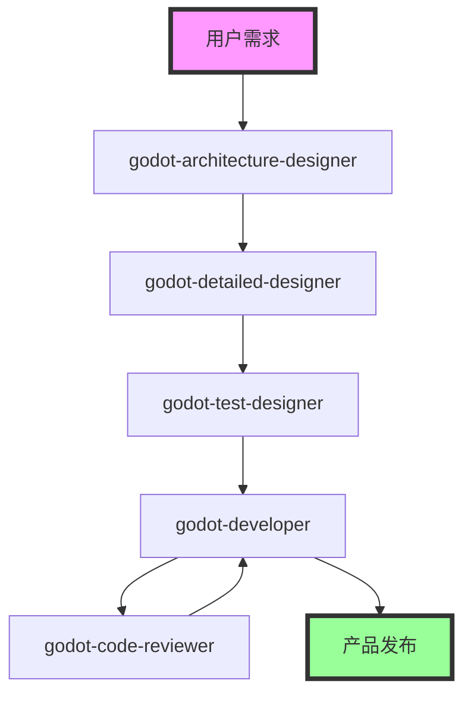

# Godot 2D游戏开发 Agents

本目录包含了专门为Godot 2D游戏开发设计的Claude Code agents，覆盖了从架构设计到代码检视的完整开发流程。

## Agents 概览

| Agent名称 | 颜色 | 主要功能 | 适用阶段 |
|-----------|------|----------|----------|
| `godot-architecture-designer` | 🔵 | 系统架构设计、模块划分、通信机制 | 项目初期架构设计 |
| `godot-detailed-designer` | 🟢 | 详细技术设计、数据结构、接口定义 | 架构设计完成后 |
| `godot-test-designer` | 🟡 | 测试策略制定、测试用例设计 | 详细设计完成后 |
| `godot-developer` | 🟣 | 模块化TDD开发、实时调试验证 | 开发实施阶段 |
| `godot-code-reviewer` | 🟠 | 代码质量检视、性能优化建议 | 代码完成后 |

## 开发流程

### 标准开发顺序

1. **架构设计阶段** → `godot-architecture-designer`
2. **详细设计阶段** → `godot-detailed-designer`
3. **测试设计阶段** → `godot-test-designer`
4. **开发实施阶段** → `godot-developer`
5. **代码检视阶段** → `godot-code-reviewer`

### 阶段依赖关系



## 使用方法

### 基本调用方式

```bash
# 在Claude Code中使用slash命令调用agent
/agent godot-architecture-designer [游戏类型] [核心玩法] [技术需求]
/agent godot-detailed-designer [架构文档路径] [模块列表] [技术需求]
/agent godot-test-designer [架构文档路径] [详细设计文档路径] [测试范围]
/agent godot-developer [模块名称] [测试用例路径] [项目路径]
/agent godot-code-reviewer [代码文件路径] [检视重点] [质量标准]
```

### 典型使用场景

#### 1. 新项目启动

```bash
# 步骤1：设计系统架构
/agent godot-architecture-designer 平台跳跃游戏 玩家控制、敌人AI、关卡系统 Godot 4.x

# 步骤2：详细技术设计
/agent godot-detailed-designer docs/01_架构设计/ 平台跳跃_架构设计文档.md PlayerController,EnemyAI,LevelManager 性能优先

# 步骤3：测试用例设计
/agent godot-test-designer docs/01_架构设计/ docs/02_详细设计/ 功能测试、性能测试
```

#### 2. 模块开发

```bash
# 开发特定模块
/agent godot-developer PlayerController tests/test_player_controller.gd ./project

# 代码质量检视
/agent godot-code-reviewer src/entities/Player.gd 性能优化、代码规范
```

## 核心特性

### 🎯 技能强制使用

每个agent都会强制调用对应的skill，确保使用专业的方法论和最佳实践：

- `godot-architecture-designer` → `skill: "godot-architecture-designer"`
- `godot-detailed-designer` → `skill: "godot-detailed-designer"`
- `godot-test-designer` → `skill: "godot-test-designer"`
- `godot-developer` → `skill: "godot-developer"`
- `godot-code-reviewer` → `skill: "godot-code-reviewer"`

### 📋 严格的前置检查

每个agent都有严格的前置条件检查，确保开发流程的有序性：

- **架构设计**：无需前置条件
- **详细设计**：必须存在架构设计文档
- **测试设计**：必须存在架构和详细设计文档
- **开发实施**：必须存在所有设计和测试文档
- **代码检视**：必须存在可检视的代码

### 🔧 工具集成

agents集成了多种专业工具：

- **MCP Filesystem**：文件操作和管理
- **MCP Godot Server**：项目运行、调试、场景编辑
- **Context7**：Godot API查询和文档检索
- **Memory**：知识库管理和信息存储

### 📊 标准化输出

每个agent都有标准化的输出格式：

- **结构化文档**：包含文字、表格、Mermaid图表
- **交付件管理**：按标准命名和目录结构存储
- **进度报告**：详细的完成状态和下一步建议
- **质量保证**：完整的验证和检查清单

## 开发原则

### ✅ 必须遵守的原则

1. **严格流程顺序** - 按照标准流程使用agents
2. **前置条件检查** - 每个阶段都验证前置条件
3. **技能强制使用** - 必须调用对应的技能
4. **文档完整性** - 确保输出文档的完整性
5. **质量验证** - 每个阶段都进行质量检查

### ❌ 严禁违反的规则

1. **禁止跳过阶段** - 不允许跳过任何开发阶段
2. **禁止跳过技能调用** - 不允许不调用指定技能
3. **禁止文档缺失** - 不允许输出不完整的文档
4. **禁止质量妥协** - 不允许降低质量标准
5. **禁止工具不使用** - 不允许不使用指定的工具

## 支持的游戏类型

这些agents支持各种Godot 2D游戏类型：

- 🏃 **平台跳跃游戏** - 平台、跳跃、物理机制
- ⚔️ **RPG游戏** - 角色扮演、任务系统、装备系统
- 🔫 **射击游戏** -射击机制、敌人AI、关卡设计
- 🧩 **解谜游戏** - 逻辑谜题、机关设计、交互系统
- 🏎️ **竞速游戏** - 物理模拟、赛道设计、计时系统
- 🎯 **休闲游戏** - 简单机制、积分系统、关卡进度

## 技术支持

### Godot版本支持

- **主要支持**：Godot 4.x (4.0及以上版本)
- **语言支持**：GDScript、C#
- **平台支持**：Windows、macOS、Linux、iOS、Android、Web

### 依赖工具

- **Claude Code**：核心AI助手平台
- **MCP Servers**：专业的工具集成
- **Godot Engine**：游戏开发引擎
- **Context7**：API文档查询服务

## 最佳实践

### 1. 项目初始化

```bash
# 推荐的项目目录结构
project/
├── .claude/
│   ├── agents/          # Agent配置文件
│   └── skills/          # 技能配置文件
├── docs/               # 设计文档
│   ├── 01_架构设计/
│   ├── 02_详细设计/
│   ├── 03_测试设计/
│   └── 04_代码检视/
├── src/                # 源代码
├── tests/              # 测试代码
└── assets/             # 游戏资源
```

### 2. 开发节奏建议

- **第1周**：完成架构设计和详细设计
- **第2周**：完成测试设计和开发环境搭建
- **第3-6周**：模块化开发和持续集成
- **第7周**：代码检视和优化
- **第8周**：测试、优化和发布准备

### 3. 质量保证

- **每阶段结束**：进行质量检查和验证
- **代码提交**：确保所有测试通过
- **定期检视**：使用code-reviewer进行质量检查
- **性能监控**：持续关注性能指标

## 故障排除

### 常见问题

1. **前置条件不满足**
   - 确保按照正确顺序使用agents
   - 检查必需的文档是否存在

2. **技能调用失败**
   - 确认skill文件正确配置
   - 检查skill名称拼写

3. **工具连接问题**
   - 验证MCP servers正确安装
   - 检查网络连接和权限

4. **文档生成失败**
   - 确保输出目录权限正确
   - 检查磁盘空间充足

### 获取帮助

如果遇到问题，可以：

1. 检查agent的错误提示信息
2. 验证项目结构和文件权限
3. 确认所有依赖工具正常工作
4. 参考skill文档中的详细说明

## 更新日志

- **v1.0.0** - 初始版本，包含5个核心agents
- 支持完整的Godot 2D游戏开发流程
- 集成MCP工具和Context7 API查询
- 标准化的文档输出和质量保证

---

🎮 **开始你的Godot 2D游戏开发之旅吧！**

从`godot-architecture-designer`开始，按照标准流程逐步完成你的游戏项目。