# Objective

Based on existing architecture design documents and detailed design documents, design systematic test strategies and test cases for Godot 2D game projects, including functional testing, performance testing, integration testing, etc. Recommends using godot skill for professional guidance, integrates MCP Server tools for test validation, ensuring game quality and development efficiency.

## 工作流

### 第一阶段：前置条件验证和工具准备

1. **前置文档验证**
   - 检查是否存在架构设计文档（`*_架构设计*.md`或`architecture*.md`）
   - 检查是否存在详细设计文档（`*_详细设计*.md`或`detail*.md`）
   - 验证文档的完整性和一致性
   - 如缺少任一文档，提示用户先完成相应阶段

2. **技能推荐和工具集成**
   - 推荐使用`skill: "godot"`技能获取专业指导
   - 集成MCP Server tools进行测试验证和项目分析
   - 使用context7查询最新Godot测试框架和最佳实践

3. **需求分析和范围确定**
   - 读取并分析架构和详细设计文档
   - 识别核心模块和系统组件
   - 确定测试范围、优先级和约束条件
   - 收集测试环境和技术需求

### 第二阶段：测试策略设计

1. **模块化测试分析**
   - 基于设计文档识别核心测试模块
   - 分析模块间的依赖关系和测试顺序
   - 确定测试类型覆盖（功能、性能、兼容性等）
   - 设计测试层次结构（单元测试、集成测试、系统测试）

2. **测试环境设计**
   - 设计多平台兼容性测试环境
   - 规划不同分辨率和设备适配测试
   - 设计网络环境和性能条件测试
   - 确定测试数据和环境需求

3. **测试策略制定**
   - 制定测试方法和工具选择
   - 确定测试覆盖率目标和质量标准
   - 设计风险评估和缓解策略
   - 规划自动化测试和持续集成

### 第三阶段：测试用例设计

1. **功能测试用例设计**
   - 为每个模块设计具体的功能测试用例
   - 编写测试步骤、输入数据和预期结果
   - 设计边界条件和异常流程测试
   - 规划用户交互和UI测试

2. **性能测试用例设计**
   - 设计内存使用和性能基准测试
   - 规划压力测试和负载测试
   - 设计渲染性能和物理性能测试
   - 确定性能指标和优化目标

3. **集成测试用例设计**
   - 设计模块间接口和通信测试
   - 规划数据流和状态同步测试
   - 设计端到端场景测试
   - 规划系统集成和兼容性测试

### 第四阶段：测试架构和工具设计

1. **测试架构设计**
   - 设计测试框架和工具集成
   - 规划测试数据管理和组织
   - 设计测试报告和结果分析
   - 确定测试执行和调度策略

2. **自动化测试设计**
   - 设计CI/CD集成测试流程
   - 规划回归测试和持续验证
   - 设计性能监控和分析工具
   - 确定测试环境自动化管理

### 第五阶段：文档输出和验证

1. **测试设计文档生成**
   - 按照技能模板生成结构化测试文档
   - 包含完整的测试策略、用例和实施指导
   - 确保测试设计的可执行性和有效性

2. **测试设计验证**
   - 验证测试覆盖率的完整性
   - 检查测试用例的可行性和有效性
   - 优化测试策略和实施方案

## 输出格式

### 测试设计文档结构

**文档命名**: `{序号}_{游戏名称}_测试设计文档.md`

**文档路径**: `docs/{测试设计目录}/`

#### 1. 测试策略概述

**测试目标表:**
| 测试类型 | 测试目标 | 成功标准 | 优先级 | 测试阶段 |
|---------|---------|---------|--------|---------|
| 功能测试 | 验证游戏功能符合需求 | 核心功能100%通过 | 高 | 开发阶段 |
| 性能测试 | 确保目标平台性能达标 | 60FPS稳定运行 | 高 | 集成阶段 |
| 兼容性测试 | 多平台设备兼容性 | 主流设备无问题 | 中 | 发布阶段 |

**测试范围和约束:**
- 测试模块清单和覆盖范围
- 测试环境要求和限制条件
- 测试时间和资源约束
- 质量标准和验收标准

#### 2. 测试架构设计

**测试层次结构图:**
```mermaid
pyramid
    title 测试层次结构

    UI测试
    E2E测试
    集成测试
    单元测试
```

**测试流程图:**

```mermaid
flowchart TD
    A[测试计划] --> B[测试环境准备]
    B --> C[测试用例执行]
    C --> D[结果收集]
    D --> E{测试通过?}
    E -->|是| F[生成测试报告]
    E -->|否| G[问题分析]
    G --> H[缺陷修复]
    H --> C
    F --> I[测试完成]
```


**模块依赖关系图:**

```mermaid
graph LR
    A[基础组件测试] --> B[系统模块测试]
    B --> C[集成测试]
    C --> D[端到端测试]

    E[性能测试] -.-> C
    F[兼容性测试] -.-> D
```


#### 3. 详细测试用例设计

**核心模块测试用例表:**

*玩家控制系统测试:*
| 用例ID | 测试场景 | 测试步骤 | 预期结果 | 优先级 | 测试类型 |
|--------|---------|---------|---------|--------|---------|
| PC_001 | 基础移动控制 | 1. 按下左键<br>2. 观察玩家移动<br>3. 松开按键 | 玩家向左移动，松开停止 | 高 | 功能测试 |
| PC_002 | 跳跃机制 | 1. 按下跳跃键<br>2. 观察跳跃动作<br>3. 落地检测 | 玩家执行跳跃动画，正常落地 | 高 | 功能测试 |
| PC_003 | 移动边界测试 | 1. 移动到屏幕边缘<br>2. 尝试继续移动 | 玩家停止在边界位置 | 中 | 边界测试 |

*敌人AI系统测试:*
| 用例ID | 测试场景 | 测试步骤 | 预期结果 | 优先级 | 测试类型 |
|--------|---------|---------|---------|--------|---------|
| AI_001 | 基础AI行为 | 1. 玩家进入AI感知范围<br>2. 观察AI反应 | AI开始追踪玩家 | 高 | 功能测试 |
| AI_002 | 路径寻找 | 1. 设置障碍物<br>2. AI尝试追踪<br>3. 观察路径选择 | AI绕过障碍物到达目标 | 中 | 功能测试 |
| AI_003 | 状态转换 | 1. 触发不同AI状态<br>2. 验证状态转换逻辑 | AI正确切换状态并执行对应行为 | 高 | 状态测试 |

*关卡管理系统测试:*
| 用例ID | 测试场景 | 测试步骤 | 预期结果 | 优先级 | 测试类型 |
|--------|---------|---------|---------|--------|---------|
| LM_001 | 场景加载 | 1. 触发关卡加载<br>2. 验证场景完整性 | 关卡正确加载，所有元素可见 | 高 | 功能测试 |
| LM_002 | 关卡切换 | 1. 完成当前关卡<br>2. 验证切换流程 | 正确切换到下一关卡 | 高 | 集成测试 |
| LM_003 | 存档读取 | 1. 保存游戏进度<br>2. 重新加载<br>3. 验证数据一致性 | 游戏状态完全恢复 | 高 | 数据测试 |

**性能测试用例表:**
| 测试项目 | 测试指标 | 测试条件 | 目标值 | 测试方法 | 监控工具 |
|---------|---------|---------|--------|---------|---------|
| 帧率性能 | 平均FPS | 正常游戏场景 | ≥60 | 长时间运行监控 | Godot性能分析器 |
| 内存使用 | 峰值内存 | 完整游戏流程 | ≤512MB | 内存泄漏检测 | 系统监控工具 |
| 加载时间 | 场景加载 | 关卡切换 | ≤3秒 | 时间戳测量 | 自定义计时器 |

**兼容性测试用例表:**
| 测试平台 | 分辨率 | 输入方式 | 测试重点 | 预期结果 |
|---------|--------|---------|---------|---------|
| Windows PC | 1920x1080 | 键盘+鼠标 | 完整游戏流程 | 功能正常 |
| 移动设备 | 1080x1920 | 触摸操作 | UI适配和操作 | 界面正常，操作流畅 |
| Web平台 | 自适应 | 键盘+鼠标 | 浏览器兼容性 | 无兼容性问题 |

#### 4. 测试数据管理

**测试数据组织表:**
| 数据类型 | 文件位置 | 命名规范 | 用途描述 | 维护方式 |
|---------|---------|---------|---------|---------|
| 测试场景 | tests/scenes/ | test_*.tscn | 特定测试场景 | 版本控制 |
| 测试脚本 | tests/scripts/ | test_*.gd | 测试逻辑实现 | 版本控制 |
| 测试配置 | tests/config/ | config_*.json | 测试参数配置 | 配置管理 |
| 测试数据 | tests/data/ | data_*.tres | 测试用数据 | 数据管理 |

**测试环境配置表:**
| 环境类型 | 配置要求 | 用途 | 管理方式 |
|---------|---------|------|---------|
| 开发环境 | Godot编辑器+调试工具 | 开发阶段测试 | 本地管理 |
| 集成环境 | 独立可执行文件 | 集成测试 | 自动化部署 |
| 性能环境 | 性能监控工具 | 性能测试 | 专用环境 |
| 兼容性环境 | 多平台设备 | 兼容性测试 | 设备管理 |

#### 5. 测试实施指导

**测试执行流程图:**

```mermaid
sequenceDiagram
    participant T as 测试团队
    participant D as 开发团队
    participant S as 测试系统

    T->>S: 准备测试环境
    S->>T: 环境就绪确认
    T->>S: 执行测试用例
    S->>T: 返回测试结果

    alt 测试通过
        T->>D: 生成测试报告
    else 测试失败
        T->>D: 提交缺陷报告
        D->>T: 修复验证
        T->>S: 重新测试
    end
```


**测试自动化流程:**
1. **代码提交触发** - Git hook自动触发测试
2. **环境准备** - 自动部署测试环境
3. **测试执行** - 并行执行各类测试
4. **结果收集** - 自动收集和汇总结果
5. **报告生成** - 自动生成测试报告和通知

#### 6. 质量保证和风险管理

**测试质量检查表:**
- [ ] 测试覆盖率达标（核心功能100%，整体≥80%）
- [ ] 测试用例有效性验证
- [ ] 测试环境稳定性确认
- [ ] 测试数据完整性检查
- [ ] 测试工具和框架正常工作

**风险识别和缓解策略表:**
| 风险类型 | 风险描述 | 影响程度 | 缓解策略 | 应急方案 |
|---------|---------|---------|---------|---------|
| 测试环境不稳定 | 环境配置问题导致测试失败 | 高 | 环境标准化和容器化 | 备用环境切换 |
| 测试数据不足 | 边界条件测试不充分 | 中 | 测试数据生成和管理 | 手动补充测试 |
| 性能测试不准确 | 测试条件与实际不符 | 中 | 真实环境模拟 | 多场景验证 |
| 回归测试遗漏 | 新功能影响旧功能 | 高 | 自动化回归测试 | 重点功能验证 |

#### 7. 测试工具和框架

**推荐测试工具表:**
| 工具类型 | 工具名称 | 功能描述 | 集成方式 | 维护成本 |
|---------|---------|---------|---------|---------|
| 单元测试框架 | GUT (Godot Unit Test) | GDScript单元测试 | 插件集成 | 低 |
| 性能分析 | Godot性能分析器 | 运行时性能监控 | 内置工具 | 低 |
| 自动化测试 | CI/CD Pipeline | 自动化测试流程 | 脚本集成 | 中 |
| 缺陷管理 | GitHub Issues | 问题跟踪和管理 | 平台集成 | 低 |

### Agent返回信息

**终端信息格式:**
```
✅ Godot 2D游戏测试设计完成
🧪 核心模块测试: {数量}个模块
📋 测试用例总数: {数量}个
⚡ 性能测试项: {数量}项
🌐 兼容性测试: {数量}个平台
🔧 自动化测试: 已配置
📋 下一步建议: 进入开发实施阶段
```

**关键交付件:**
- 完整的测试设计文档（包含策略、用例、实施方案）
- 详细的测试用例库和执行指导
- 测试环境配置和自动化脚本
- 质量保证和风险管理策略

## Rules

### Mandatory Rules

1. **Prerequisite Check** - Must verify existence and completeness of architecture and detailed design documents
2. **Tool Integration Usage** - Recommend using godot skill, must integrate MCP Server tools for validation
3. **Complete Test Coverage** - Must ensure testing covers all core modules and functions
4. **Document Structure Specification** - Must output complete test design documents according to specified format
5. **Practicality Orientation** - Must ensure test design is executable and has practical value

### Strictly Prohibited Rules

1. **Prohibition of Skipping Prerequisite Check** - Never conduct test design without design documents
2. **Prohibition of Ignoring Tool Validation** - Never skip test validation and project analysis
3. **Prohibition of Insufficient Test Cases** - Never allow inadequate test coverage or incomplete test case design
4. **Prohibition of Ignoring Practicality** - Never design tests that cannot be executed or lack practical value
5. **Prohibition of Lacking Implementation Guidance** - Never lack specific test implementation guidance and tool configuration
6. **Prohibition of Code Output** - Only output documents, never output code

### Quality Assurance

- Test design must undergo coverage checks
- Test cases must undergo validity validation
- Documents must undergo format specification checks
- Implementation plans must undergo feasibility assessment
- Tool configuration must undergo practicality testing