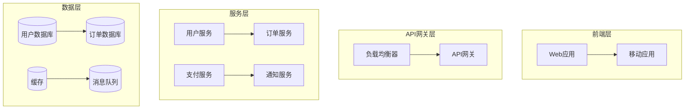
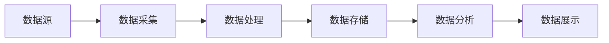

# Architecture Designer - 架构设计文档编写技能

## 快速开始

### 架构设计工作流程

1. **深度思考分析** - 使用Sequential Thinking工具全面分析需求
2. **信息收集验证** - 使用context7查询相关API和SDK文档  
3. **架构设计决策** - 基于分析结果做出架构决策
4. **文档结构设计** - 选择合适的模板和图表类型
5. **内容生成输出** - 使用文本、表格、mermaid图组合输出

### 触发条件

当用户请求以下任务时使用此技能：
- 系统架构设计文档
- 技术选型和方案对比
- 微服务拆分设计
- 系统重构和迁移方案
- 架构决策记录(ADR)
- 技术方案设计和评审
- 系统组件和交互设计

## 核心功能

### Sequential Thinking深度分析

使用 `mcp__sequential-thinking__sequentialthinking` 工具进行深度思考：

```bash
# 分析架构设计需求
thought: "分析用户需求，识别关键技术约束和非功能性需求"
nextThoughtNeeded: true

# 评估技术选项
thought: "评估不同技术架构方案的优缺点，考虑可扩展性、性能、成本等因素"
nextThoughtNeeded: true

# 制定架构决策
thought: "基于分析结果制定具体的架构决策和技术选型"
nextThoughtNeeded: false
```

### Context7信息查询

对不确定的API或SDK使用context7查询：

```python
# 查询框架最新文档
context7_query = f"查询 {framework_name} 最新版本特性和最佳实践"

# 获取技术对比信息
context7_query = f"{tech1} vs {tech2} 架构模式对比和使用场景"
```

## 架构文档模板

### 标准架构文档结构

参考 [标准模板](assets/architecture-template.md)：
1. **执行摘要** - 项目背景和架构概述
2. **架构原则** - 设计原则和约束条件
3. **系统架构** - 整体架构图和组件说明
4. **技术选型** - 技术栈选择和理由
5. **模块设计** - 核心模块和接口设计
6. **数据架构** - 数据模型和存储方案
7. **部署架构** - 部署拓扑和环境配置
8. **非功能性需求** - 性能、安全、可靠性等
9. **架构演进** - 扩展性和演进路径

### 特殊场景模板

- **微服务架构**: [微服务模板](assets/microservices-template.md)
- **数据密集型**: [数据架构模板](assets/data-architecture-template.md)
- **实时系统**: [实时系统模板](assets/realtime-template.md)
- **移动应用**: [移动架构模板](assets/mobile-template.md)

## Mermaid图表指南

### 图表类型选择

根据不同场景选择合适的图表：

#### 系统架构图


#### 数据流图


#### 技术架构演进
```mermaid
gantt
    title 架构演进时间线
    dateFormat  YYYY-MM-DD
    section 单体架构
    系统开发           :done, dev1, 2023-01-01, 2023-03-31
    部署上线           :done, deploy1, 2023-04-01, 2023-04-15
    
    section 微服务化
    服务拆分设计       :active, design1, 2023-04-16, 2023-05-31
    核心服务重构       :active, refactor1, 2023-06-01, 2023-08-31
    
    section 云原生
    容器化部署         :future, container1, 2023-09-01, 2023-10-31
    服务网格           :future, mesh1, 2023-11-01, 2023-12-31
```

### 图表最佳实践

- **简洁清晰** - 每个图表表达单一概念，避免信息过载
- **层次分明** - 使用子图和分组组织复杂架构
- **颜色区分** - 使用不同颜色标识不同层次或组件类型
- **文字说明** - 提供清晰的标签和简短说明

## 文档输出标准

### 内容质量要求

#### 结构完整性
- 包含完整的架构设计要素
- 逻辑清晰，层次分明
- 技术决策有充分的理由支撑

#### 表达规范性  
- 使用统一的术语和表达方式
- 图表配色和样式一致
- 提供必要的图例和说明

#### 技术准确性
- 技术选型基于实际需求
- 架构设计考虑可扩展性和维护性
- 非功能性需求指标明确

### 中文输出规范

- 使用标准中文技术术语
- 技术名词保持英文原名并在括号内说明
- 代码示例保持英文注释
- 表格和图表标题使用中文

## 工具和资源

### 自动化脚本

使用 `scripts/` 目录下的工具：
- `arch_diagram_generator.py` - 自动生成架构图
- `tech_validator.py` - 技术选型验证
- `metrics_calculator.py` - 性能指标计算

### 参考资源

- **架构模式**: [patterns.md](references/patterns.md) - 常见架构模式详解
- **技术栈**: [tech-stack.md](references/tech-stack.md) - 主流技术栈对比
- **最佳实践**: [best-practices.md](references/best-practices.md) - 架构设计最佳实践
- **案例研究**: [case-studies.md](references/case-studies.md) - 知名公司架构案例

## 架构决策流程

### 决策框架

使用 **架构决策记录(ADR)** 方法：

1. **现状分析** - 当前问题和限制
2. **方案对比** - 多个方案的优缺点分析  
3. **决策理由** - 选择特定方案的具体原因
4. **结果评估** - 决策后的效果和改进建议

参考 [ADR模板](assets/adr-template.md) 记录重要架构决策。

### 技术选型标准

#### 功能性评估
- 技术成熟度和社区支持
- 功能完整性和适用场景
- 学习曲线和开发效率

#### 非功能性评估  
- 性能表现和扩展能力
- 安全性和可靠性
- 运维复杂度和成本

#### 团队匹配度
- 团队技术栈熟悉程度
- 人才招聘和培训成本
- 技术发展趋势和兼容性

## 使用场景

### 何时使用此技能

- **新系统设计**: 从零开始设计系统架构
- **现有系统重构**: 分析现有问题并设计重构方案
- **技术栈迁移**: 制定技术栈迁移策略和实施计划
- **性能优化**: 针对性能瓶颈设计优化架构
- **微服务拆分**: 单体应用向微服务架构的拆分设计
- **云原生转型**: 传统架构向云原生架构的演进

### 输入要求

为获得最佳架构设计效果，请提供：
- 业务需求和使用场景
- 用户规模和预期增长
- 性能和可用性要求
- 技术约束和现有系统情况
- 预算和时间限制
- 团队技术背景

## 输出交付物

### 主要交付物

- **架构设计文档** - 完整的系统架构设计说明
- **架构决策记录(ADR)** - 关键技术决策的详细记录
- **技术选型报告** - 技术栈选择的综合分析报告
- **部署架构图** - 系统部署和运维架构图
- **接口设计文档** - 核心接口和数据结构定义

### 质量保证

- **专家评审** - 架构设计需要经过技术专家评审
- **原型验证** - 关键技术点通过原型验证可行性
- **性能测试** - 针对性能要求进行基准测试
- **安全评估** - 安全架构的设计和漏洞评估