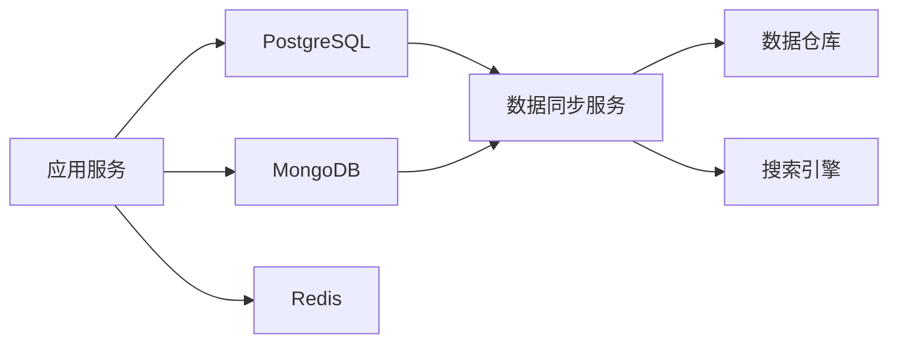
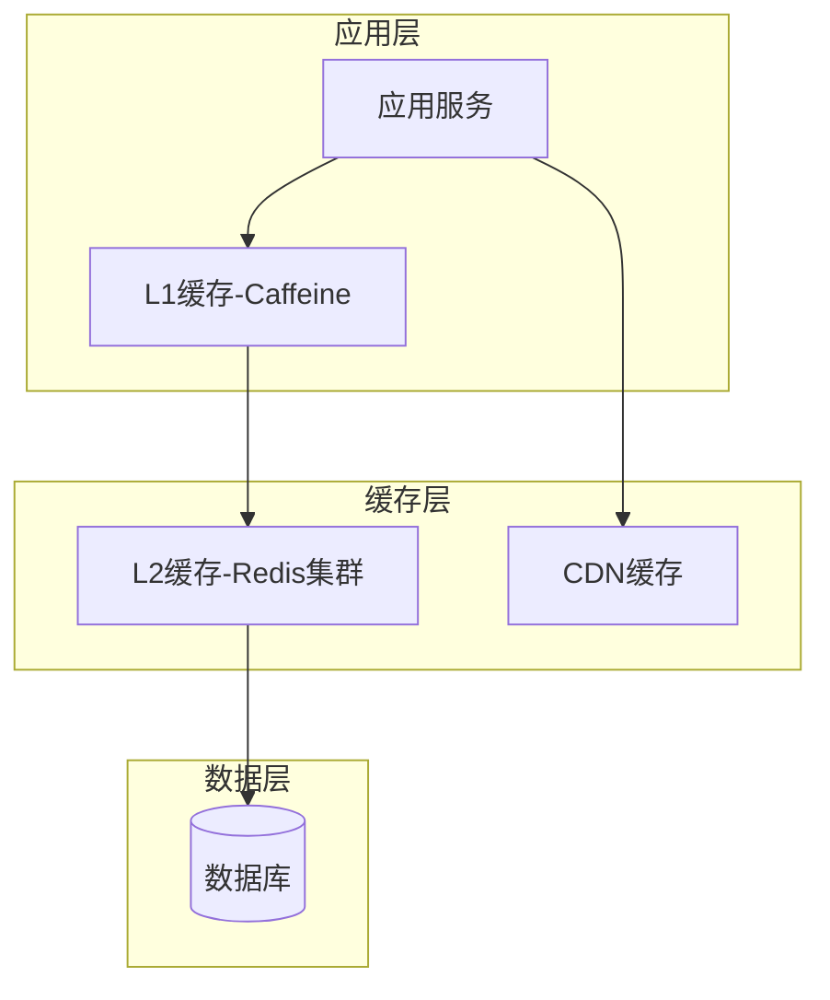

# 架构决策记录(ADR)模板

## ADR-001: 选择微服务架构

**状态**: 已接受  
**日期**: 2024-01-15  
**决策者**: 架构委员会

### 背景

随着业务的快速增长，现有的单体应用面临以下挑战：
- 开发效率低下，功能耦合严重
- 部署周期长，发布风险高
- 技术栈单一，无法根据业务特点选择合适技术
- 团队规模扩大，协作复杂度高

### 决策

采用微服务架构，将单体应用拆分为多个独立部署的服务。

### 理由

#### 优势
1. **业务敏捷性**: 服务独立开发部署，支持快速迭代
2. **技术灵活性**: 不同服务可选择最适合的技术栈
3. **弹性伸缩**: 可根据负载情况独立扩展服务
4. **故障隔离**: 单个服务故障不影响整个系统
5. **团队自治**: 小团队负责特定服务，提高开发效率

#### 劣势及应对措施
1. **系统复杂性增加**: 
   - 采用服务网格管理服务间通信
   - 建立完善的监控和日志系统
2. **分布式事务复杂**: 
   - 采用Saga模式处理分布式事务
   - 使用事件驱动架构保证最终一致性
3. **运维成本提高**: 
   - 投资自动化运维平台
   - 建立DevOps文化和流程

### 后果

- **短期**: 开发和运维复杂度增加，团队需要学习新技术
- **长期**: 系统可扩展性和可维护性显著提升，支持业务快速发展

### 实施计划

1. **Q1 2024**: 完成技术调研和原型验证
2. **Q2 2024**: 选择非核心服务进行试点改造
3. **Q3 2024**: 建立微服务基础平台和工具链
4. **Q4 2024**: 逐步迁移核心业务服务

---

## ADR-002: 数据库选型决策

**状态**: 已接受  
**日期**: 2024-01-20  
**决策者**: 技术团队

### 背景

新系统需要选择合适的数据库技术来支撑业务发展，主要考虑：
- 数据存储和查询性能
- 数据一致性和可靠性
- 扩展性和运维成本
- 团队技术熟悉度

### 候选方案

#### 方案一: 关系型数据库 (PostgreSQL)
- **优势**: 数据一致性强，功能丰富，生态成熟
- **劣势**: 水平扩展复杂，性能瓶颈明显
- **适用场景**: 用户数据、订单数据等结构化数据

#### 方案二: 文档数据库 (MongoDB)
- **优势**: Schema灵活，水平扩展简单，开发效率高
- **劣势**: 一致性较弱，查询功能有限
- **适用场景**: 商品信息、用户画像等半结构化数据

#### 方案三: 时序数据库 (InfluxDB)
- **优势**: 时间序列数据性能优秀，压缩率高
- **劣势**: 功能单一，不支持复杂查询
- **适用场景**: 监控指标、业务指标等时序数据

### 决策

采用混合数据库策略：
- **PostgreSQL**: 核心业务数据
- **MongoDB**: 商品和用户画像数据  
- **Redis**: 缓存和会话数据
- **InfluxDB**: 监控和指标数据

### 理由

1. **业务需求匹配**: 不同类型数据选择最适合的存储方案
2. **性能优化**: 针对不同数据特点进行存储优化
3. **技术多样性**: 团队掌握多种数据库技术
4. **成本控制**: 避免过度设计，合理使用资源

### 实施细节

#### 数据同步策略


#### 数据一致性保证
- **强一致性**: 用户、订单等核心数据使用数据库事务
- **最终一致性**: 通过事件驱动同步异构数据库
- **缓存一致性**: 采用缓存失效和主动更新策略

---

## ADR-003: API网关技术选型

**状态**: 已接受  
**日期**: 2024-01-25  
**决策者**: 架构团队

### 背景

微服务架构需要统一的API网关来处理：
- 路由和负载均衡
- 认证和授权
- 限流和熔断
- 监控和日志

### 候选方案

#### 方案一: Kong
- **优势**: 功能丰富，插件生态好，性能优秀
- **劣势**: 配置复杂，学习成本高
- **成本**: 开源版本免费，企业版收费

#### 方案二: Spring Cloud Gateway
- **优势**: Java生态，与Spring体系集成好，配置简单
- **劣势**: 功能相对有限，性能一般
- **成本**: 完全开源免费

#### 方案三: APISIX
- **优势**: 性能优秀，插件丰富，云原生架构
- **劣势**: 相对较新，生态不够成熟
- **成本**: 开源版本免费

### 决策

选择 **Kong** 作为API网关解决方案。

### 理由

1. **功能完整性**: 提供企业级API管理功能
2. **生态成熟度**: 丰富的插件和社区支持
3. **性能表现**: 经过大规模生产环境验证
4. **团队能力**: 有团队具备Kong使用经验

### 实施计划

#### 部署架构
```yaml
# Kong部署配置
apiVersion: apps/v1
kind: Deployment
metadata:
  name: kong
spec:
  replicas: 3
  selector:
    matchLabels:
      app: kong
  template:
    spec:
      containers:
      - name: kong
        image: kong:3.4
        ports:
        - containerPort: 8000
        - containerPort: 8443
        env:
        - name: KONG_DATABASE
          value: "postgres"
        - name: KONG_PG_HOST
          value: "postgres-service"
```

#### 插件配置
```yaml
# 核心插件配置
plugins:
  - name: rate-limiting
    config:
      minute: 1000
      hour: 10000
      
  - name: prometheus
    config:
      per_consumer: true
      
  - name: jwt
    config:
      secret_is_base64: false
      
  - name: cors
    config:
      origins: ["*"]
      methods: ["GET", "POST", "PUT", "DELETE"]
```

---

## ADR-004: 服务间通信协议选择

**状态**: 已接受  
**日期**: 2024-02-01  
**决策者**: 微服务团队

### 背景

微服务之间需要高效可靠的通信机制，主要考虑：
- 通信性能和延迟
- 开发复杂度和维护成本
- 协议标准化和工具支持
- 团队技术栈熟悉度

### 候选方案

#### 方案一: HTTP/REST API
- **优势**: 标准化程度高，工具支持好，调试简单
- **劣势**: 性能相对较低，连接开销大
- **适用场景**: 实时性要求不高的同步调用

#### 方案二: gRPC
- **优势**: 性能优秀，基于HTTP/2，支持流式传输
- **劣势**: 协议相对复杂，调试困难
- **适用场景**: 高性能要求的内部服务调用

#### 方案三: 消息队列 (RabbitMQ/Kafka)
- **优势**: 异步解耦，削峰填谷，可靠性高
- **劣势**: 架构复杂，消息顺序保证困难
- **适用场景**: 事件驱动，异步处理

### 决策

采用混合通信策略：
- **同步调用**: gRPC (高性能) + HTTP/REST (兼容性)
- **异步通信**: RabbitMQ (业务事件) + Kafka (数据流)

### 理由

1. **性能优化**: 高频调用使用gRPC提高性能
2. **兼容性**: REST API保持与外部系统的兼容
3. **业务解耦**: 消息队列支持事件驱动架构
4. **数据流处理**: Kafka支持大数据流处理

### 技术实现

#### gRPC服务定义
```protobuf
syntax = "proto3";

package user;

service UserService {
  rpc GetUser(GetUserRequest) returns (UserResponse);
  rpc CreateUser(CreateUserRequest) returns (UserResponse);
  rpc ListUsers(ListUsersRequest) returns (ListUsersResponse);
}

message User {
  string id = 1;
  string username = 2;
  string email = 3;
  int64 created_at = 4;
}
```

#### 消息格式设计
```json
{
  "messageId": "user-created-001",
  "messageType": "UserCreated",
  "version": "1.0",
  "timestamp": "2024-01-01T12:00:00Z",
  "source": "user-service",
  "payload": {
    "userId": "12345",
    "username": "zhangsan",
    "email": "zhangsan@example.com"
  }
}
```

---

## ADR-005: 缓存策略设计

**状态**: 已接受  
**日期**: 2024-02-05  
**决策者**: 性能优化团队

### 背景

系统性能优化需要建立统一的缓存策略，解决：
- 数据库访问性能瓶颈
- 高并发读写压力
- 数据一致性保证
- 缓存容量管理

### 候选方案

#### 方案一: 多级缓存
- **L1缓存**: 应用内存缓存 (Caffeine)
- **L2缓存**: 分布式缓存 (Redis)
- **CDN缓存**: 静态资源缓存

#### 方案二: 缓存分离
- **读缓存**: 专门处理查询请求
- **写缓存**: 专门处理写入请求
- **会话缓存**: 用户会话信息

#### 方案三: 智能缓存
- **热点数据缓存**: 自动识别热点数据
- **预加载缓存**: 基于访问模式预加载
- **失效策略**: 多种失效策略组合

### 决策

采用**多级缓存**策略，结合智能缓存管理。

### 理由

1. **性能最优**: 多级缓存最大化命中率
2. **成本控制**: 合理利用各级存储介质
3. **一致性保证**: 分层失效策略
4. **运维简化**: 统一的缓存管理平台

### 实施细节

#### 缓存架构


#### 缓存策略
| 数据类型 | L1缓存 | L2缓存 | CDN缓存 | 失效策略 |
|---------|--------|--------|---------|---------|
| 用户信息 | 30分钟 | 2小时 | 不缓存 | 主动更新 |
| 商品信息 | 10分钟 | 1小时 | 24小时 | 定时刷新 |
| 配置信息 | 5分钟 | 30分钟 | 不缓存 | 主动失效 |
| 静态资源 | 不缓存 | 不缓存 | 7天 | 版本控制 |

#### 一致性保证
- **写穿透**: 写入同时更新缓存
- **延迟双删**: 删除缓存，更新数据，再次删除缓存
- **版本控制**: 使用版本号处理并发更新