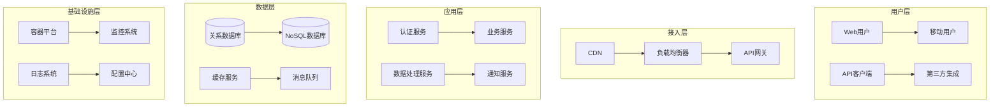
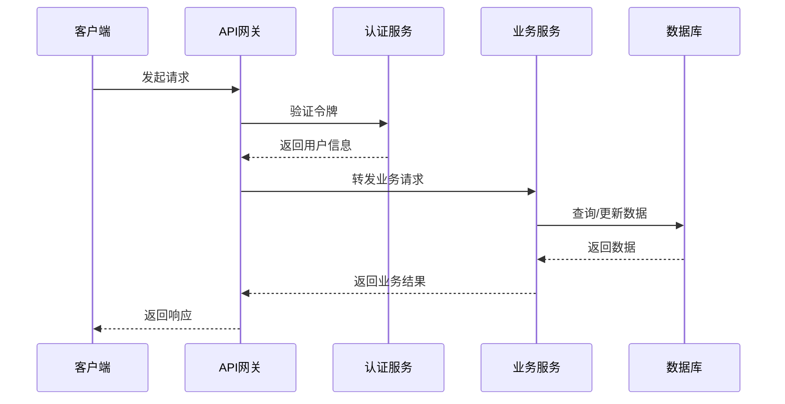
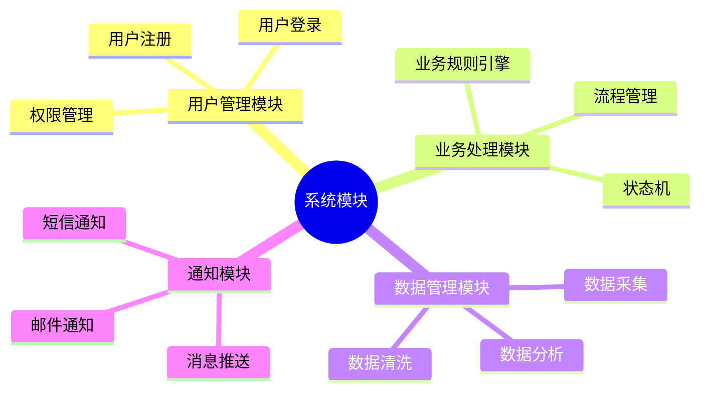
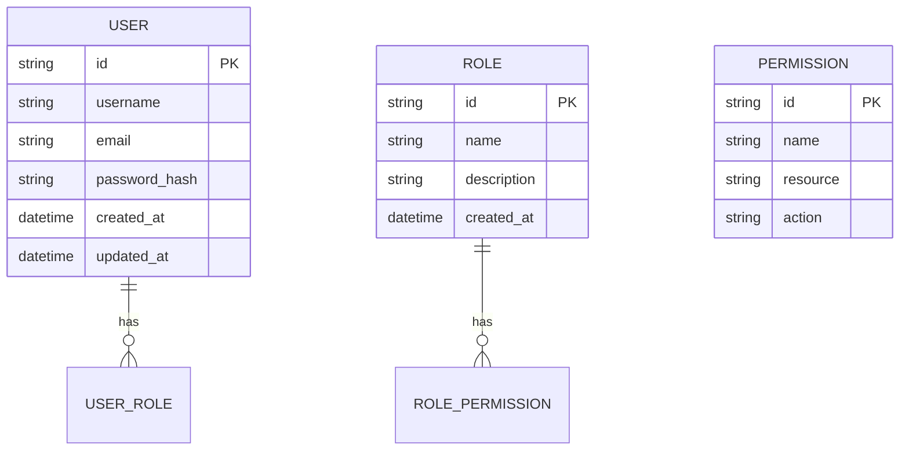
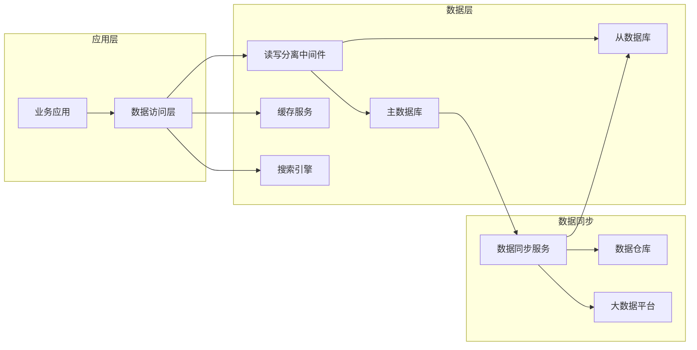
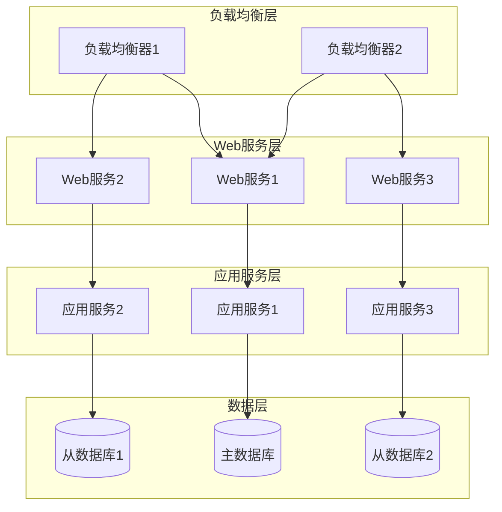

# 系统架构设计文档模板

## 1. 执行摘要

### 1.1 项目背景
- 项目名称和概述
- 业务目标和价值
- 项目范围和边界

### 1.2 架构概述
- 整体架构思路
- 核心技术选型
- 关键设计决策

### 1.3 质量目标
- 性能指标要求
- 可用性目标
- 安全性要求

## 2. 架构原则

### 2.1 设计原则
- 简单性原则 (Keep it Simple)
- 高内聚低耦合
- 可扩展性优先
- 容错性设计

### 2.2 技术约束
- 现有系统集成要求
- 团队技术栈限制
- 预算和时间约束
- 合规性要求

### 2.3 业务约束
- 用户规模预估
- 业务增长预期
- 运维成本控制

## 3. 系统架构

### 3.1 整体架构图



### 3.2 核心组件说明
- **API网关**: 统一接入、路由、认证、限流
- **业务服务**: 核心业务逻辑处理
- **数据服务**: 数据存储和查询
- **基础设施**: 监控、日志、配置管理

### 3.3 服务交互流程



## 4. 技术选型

### 4.1 前端技术栈

| 技术领域 | 选择方案 | 理由 | 备选方案 |
|---------|---------|------|---------|
| 框架 | React 18 | 生态成熟，团队熟悉 | Vue 3, Angular |
| 状态管理 | Redux Toolkit | 标准化状态管理 | Zustand, MobX |
| UI组件库 | Ant Design | 组件丰富，中文友好 | Material-UI, Element Plus |
| 构建工具 | Vite | 构建速度快，配置简单 | Webpack 5 |

### 4.2 后端技术栈

| 技术领域 | 选择方案 | 理由 | 备选方案 |
|---------|---------|------|---------|
| 编程语言 | Java 17 | 生态成熟，性能优秀 | Go, Python |
| 框架 | Spring Boot 3 | 开发效率高，社区支持好 | Spring Cloud, Micronaut |
| 数据库 | PostgreSQL 15 | 功能强大，支持JSONB | MySQL 8.0, MongoDB |
| 缓存 | Redis 7 | 性能优秀，数据结构丰富 | Memcached, Hazelcast |

### 4.3 基础设施

| 技术领域 | 选择方案 | 理由 | 备选方案 |
|---------|---------|------|---------|
| 容器化 | Docker + Kubernetes | 标准化部署，弹性伸缩 | Docker Swarm, Nomad |
| 服务网格 | Istio | 流量管理，可观测性 | Linkerd, Consul Connect |
| 监控系统 | Prometheus + Grafana | 云原生监控标准 | ELK Stack, Datadog |
| 日志系统 | ELK Stack | 日志收集分析强大 | Fluentd + Loki |

## 5. 模块设计

### 5.1 核心模块划分



### 5.2 接口设计

#### RESTful API设计规范
- 使用HTTP动词表示操作：GET、POST、PUT、DELETE
- 使用名词表示资源，避免动词
- 使用HTTP状态码表示结果
- 统一的响应格式

```json
{
  "code": 200,
  "message": "success",
  "data": {
    "id": "123",
    "name": "张三",
    "email": "zhangsan@example.com"
  },
  "timestamp": "2024-01-01T12:00:00Z"
}
```

### 5.3 数据模型设计

#### 用户实体


## 6. 数据架构

### 6.1 数据存储架构



### 6.2 数据一致性策略

| 数据类型 | 一致性要求 | 实现方案 |
|---------|-----------|---------|
| 用户数据 | 强一致性 | 数据库事务，主从同步 |
| 订单数据 | 最终一致性 | 消息队列，补偿机制 |
| 日志数据 | 弱一致性 | 异步写入，批量处理 |
| 缓存数据 | 最终一致性 | 缓存失效，主动更新 |

### 6.3 数据备份和恢复

- **备份策略**: 全量备份 + 增量备份
- **备份频率**: 全量每日，增量每小时
- **存储位置**: 本地存储 + 云端存储
- **恢复测试**: 每月进行恢复演练

## 7. 部署架构

### 7.1 部署拓扑



### 7.2 环境配置

| 环境 | 用途 | 配置规模 | 数据库 |
|-----|-----|---------|--------|
| 开发环境 | 功能开发和调试 | 2核4G * 2台 | 单实例 |
| 测试环境 | 功能测试和集成测试 | 4核8G * 2台 | 主从复制 |
| 预发环境 | 性能测试和回归测试 | 8核16G * 3台 | 主从复制 |
| 生产环境 | 正式对外服务 | 16核32G * 5台 | 主从复制 + 读写分离 |

### 7.3 CI/CD流程


## 8. 非功能性需求

### 8.1 性能要求

| 指标 | 目标值 | 测试条件 |
|-----|-------|---------|
| 响应时间 | P95 < 200ms | 正常负载下 |
| 吞吐量 | 1000 QPS | 并发用户1000 |
| 可用性 | 99.9% | 年度统计 |
| 扩展性 | 支持10倍用户增长 | 水平扩展 |

### 8.2 安全性设计

#### 认证和授权
- **认证方式**: JWT + OAuth2.0
- **密码策略**: 最少8位，包含大小写字母和数字
- **会话管理**: Token过期时间2小时
- **权限控制**: RBAC模型

#### 数据安全
- **传输加密**: HTTPS/TLS 1.3
- **存储加密**: 敏感数据AES-256加密
- **数据脱敏**: 日志和测试环境数据脱敏
- **访问控制**: 数据库访问白名单

### 8.3 可观测性

#### 监控指标
- **系统指标**: CPU、内存、磁盘、网络
- **应用指标**: QPS、响应时间、错误率
- **业务指标**: 用户活跃度、转化率

#### 日志管理
- **日志级别**: DEBUG、INFO、WARN、ERROR
- **日志格式**: 结构化JSON格式
- **日志聚合**: ELK Stack集中收集
- **日志保留**: 热数据30天，冷数据1年

## 9. 架构演进

### 9.1 短期规划 (0-6个月)
- 完成核心功能开发
- 建立基础的监控和日志系统
- 优化数据库查询性能
- 实现基本的缓存机制

### 9.2 中期规划 (6-18个月)
- 实现微服务架构拆分
- 引入服务网格
- 建立完善的CI/CD流程
- 实现自动化运维

### 9.3 长期规划 (18-36个月)
- 云原生架构转型
- 多活数据中心部署
- AI能力集成
- 边缘计算支持

### 9.4 风险评估

| 风险项 | 概率 | 影响 | 应对措施 |
|-------|------|------|---------|
| 技术选型风险 | 中 | 高 | 充分调研，小规模验证 |
| 性能瓶颈 | 高 | 中 | 压力测试，性能监控 |
| 安全漏洞 | 中 | 高 | 安全审计，渗透测试 |
| 团队技能不足 | 低 | 中 | 技术培训，外部支持 |

## 10. 附录

### 10.1 术语表
- **API**: Application Programming Interface，应用程序编程接口
- **CI/CD**: Continuous Integration/Continuous Deployment，持续集成/持续部署
- **QPS**: Queries Per Second，每秒查询数
- **RBAC**: Role-Based Access Control，基于角色的访问控制

### 10.2 参考文档
- [架构设计原则文档](../references/principles.md)
- [技术选型评估报告](../references/tech-evaluation.md)
- [性能测试报告](../references/performance-test.md)
- [安全评估报告](../references/security-assessment.md)