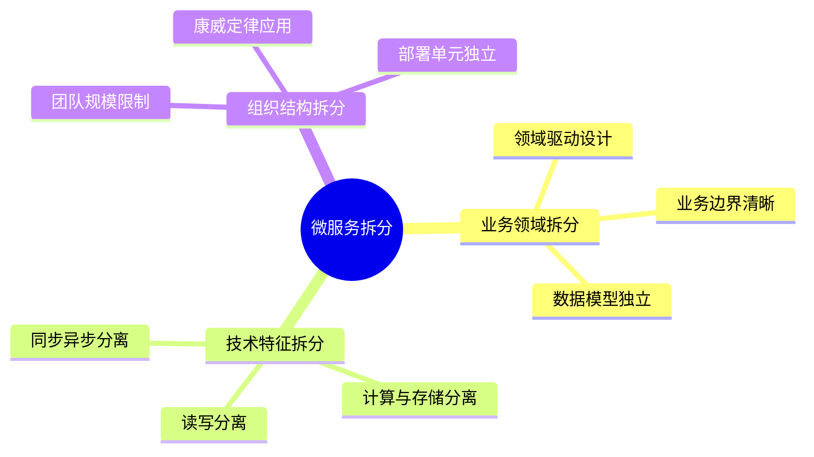
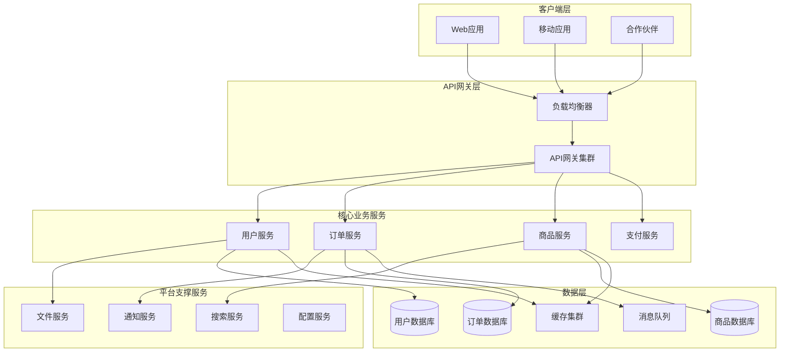
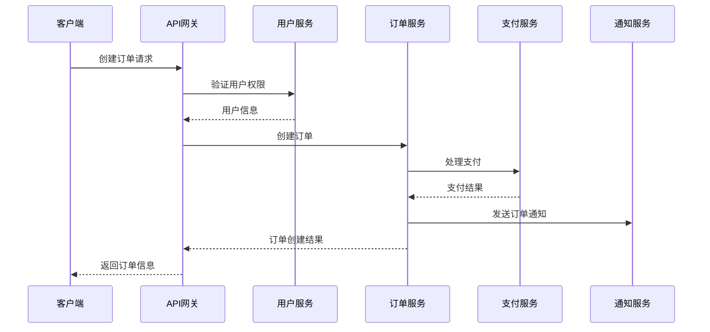
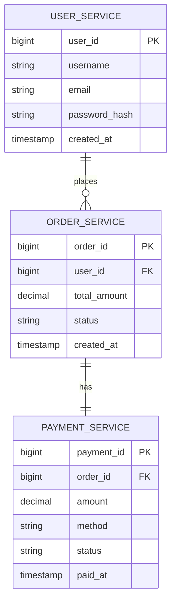
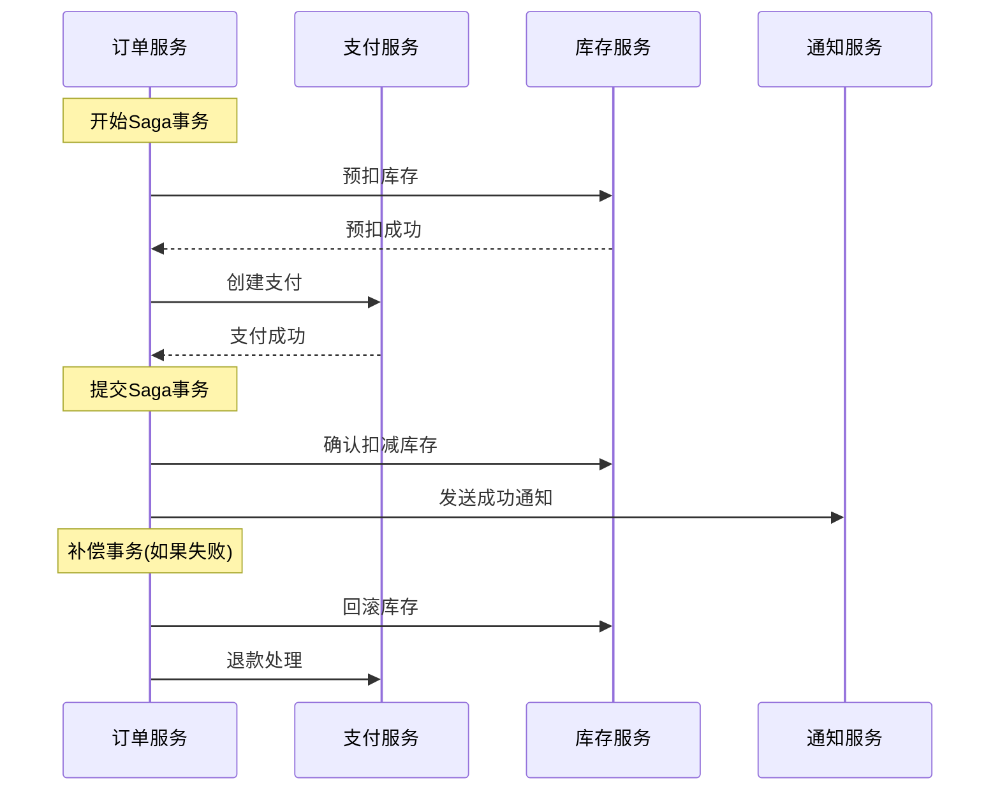
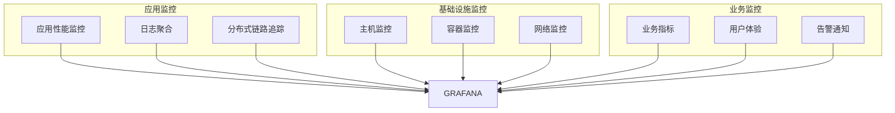

# 微服务架构设计模板

## 1. 微服务架构概述

### 1.1 架构愿景
- 业务快速迭代和创新
- 系统弹性伸缩和容错
- 技术栈多样化和团队自治
- 降低系统复杂度和维护成本

### 1.2 核心原则
- **单一职责**: 每个服务专注一个业务领域
- **独立部署**: 服务可独立开发、测试、部署
- **去中心化**: 避免单点故障，分布治理
- **容错设计**: 服务隔离，优雅降级

## 2. 服务拆分策略

### 2.1 拆分原则



### 2.2 服务识别矩阵

| 业务能力 | 数据模型 | 技术栈 | 团队归属 | 部署频率 |
|---------|---------|--------|---------|---------|
| 用户管理 | 用户、角色、权限 | Java/Spring | 用户团队 | 每周 |
| 订单管理 | 订单、支付、物流 | Node.js/Express | 订单团队 | 每日 |
| 商品管理 | 商品、分类、库存 | Python/Django | 商品团队 | 每周 |
| 通知服务 | 消息、推送、邮件 | Go/Gin | 平台团队 | 每月 |

### 2.3 服务边界定义

#### 核心业务服务
- **用户服务**: 用户注册、登录、权限管理
- **订单服务**: 订单创建、状态管理、支付集成
- **商品服务**: 商品信息、库存管理、分类体系
- **支付服务**: 支付处理、对账、退款

#### 平台支撑服务
- **通知服务**: 消息推送、邮件、短信通知
- **搜索服务**: 商品搜索、推荐算法
- **文件服务**: 文件上传、存储、CDN分发
- **配置服务**: 配置管理、动态刷新

## 3. 微服务架构图

### 3.1 整体架构视图



### 3.2 服务交互模式



## 4. 服务设计规范

### 4.1 API设计标准

#### RESTful API规范
```yaml
# 用户服务API
/users:
  get:
    summary: 获取用户列表
    parameters:
      - name: page
        type: integer
        default: 1
      - name: size
        type: integer
        default: 20
    responses:
      200:
        description: 成功返回用户列表
        schema:
          type: object
          properties:
            code:
              type: integer
            data:
              type: array
              items:
                $ref: '#/definitions/User'

/users/{id}:
  get:
    summary: 获取用户详情
    parameters:
      - name: id
        type: string
        required: true
    responses:
      200:
        description: 成功返回用户详情
      404:
        description: 用户不存在
```

#### 服务间通信
- **同步通信**: HTTP/REST API，用于实时数据查询
- **异步通信**: 消息队列，用于事件驱动和业务解耦
- **数据一致性**: Saga模式，分布式事务处理

### 4.2 数据管理策略

#### 数据库设计原则
- **每个服务独立数据库**: 避免跨服务数据库访问
- **数据一致性**: 最终一致性，通过事件同步
- **数据查询**: API网关聚合，GraphQL查询



### 4.3 服务治理

#### 服务注册与发现
```yaml
# 服务注册配置
spring:
  cloud:
    consul:
      host: consul-server
      port: 8500
      discovery:
        service-name: ${spring.application.name}
        health-check-path: /actuator/health
        health-check-interval: 15s
        tags: 
          - version=${spring.application.version}
          - environment=${spring.profiles.active}
```

#### 负载均衡策略
- **轮询均衡**: 适用于服务实例性能相近
- **加权轮询**: 适用于实例性能不均
- **最少连接**: 适用于长连接服务
- **一致性哈希**: 适用于有状态服务

## 5. 数据一致性

### 5.1 Saga事务模式



### 5.2 事件驱动架构

#### 事件设计规范
```json
{
  "eventId": "order-created-20240101-001",
  "eventType": "OrderCreated",
  "eventVersion": "1.0",
  "timestamp": "2024-01-01T12:00:00Z",
  "source": "order-service",
  "data": {
    "orderId": "12345",
    "userId": "67890",
    "totalAmount": 299.00,
    "items": [
      {
        "productId": "1001",
        "quantity": 2,
        "price": 149.50
      }
    ]
  },
  "correlationId": "req-12345"
}
```

### 5.3 数据同步策略

| 同步类型 | 适用场景 | 实现方式 | 一致性保证 |
|---------|---------|---------|-----------|
| 实时同步 | 关键业务数据 | 事件驱动，CDC | 强一致性 |
| 定时同步 | 报表数据 | 批处理任务 | 最终一致性 |
| 按需同步 | 查询聚合 | API调用 | 弱一致性 |

## 6. 容错和弹性

### 6.1 容错模式

#### 断路器模式
```yaml
# 断路器配置
resilience4j:
  circuitbreaker:
    instances:
      userService:
        failureRateThreshold: 50
        waitDurationInOpenState: 30s
        slidingWindowSize: 10
        minimumNumberOfCalls: 5
        permittedNumberOfCallsInHalfOpenState: 3
```

#### 重试机制
- **指数退避**: 避免服务雪崩
- **重试次数限制**: 防止无限重试
- **重试条件**: 仅对可重试异常进行重试

### 6.2 限流和降级

#### 限流策略
```yaml
# 限流配置
rate-limit:
  global:
    qps: 1000
    burst: 2000
  services:
    user-service:
      qps: 500
      token-refill-rate: 10
      bucket-capacity: 100
    order-service:
      qps: 300
      token-refill-rate: 5
      bucket-capacity: 50
```

#### 服务降级
- **功能降级**: 关闭非核心功能
- **数据降级**: 返回缓存数据或默认值
- **体验降级**: 简化用户界面

## 7. 监控和可观测性

### 7.1 监控体系



### 7.2 关键指标

#### 服务健康指标
- **可用性**: 服务正常运行时间百分比
- **响应时间**: P50、P95、P99响应时间
- **错误率**: HTTP 4xx、5xx错误率
- **吞吐量**: QPS、TPS处理能力

#### 业务指标
- **用户活跃度**: DAU、MAU
- **业务转化率**: 关键业务流程转化
- **系统稳定性**: 故障恢复时间(MTTR)

### 7.3 告警策略

```yaml
# 告警规则示例
groups:
  - name: service-alerts
    rules:
      - alert: ServiceHighErrorRate
        expr: rate(http_requests_total{status=~"5.."}[5m]) > 0.1
        for: 2m
        labels:
          severity: critical
        annotations:
          summary: "服务 {{ $labels.service }} 错误率过高"
          
      - alert: ServiceHighLatency
        expr: histogram_quantile(0.95, rate(http_request_duration_seconds_bucket[5m])) > 0.5
        for: 5m
        labels:
          severity: warning
        annotations:
          summary: "服务 {{ $labels.service }} 响应延迟过高"
```

## 8. 部署和运维

### 8.1 容器化部署

#### Dockerfile最佳实践
```dockerfile
# 多阶段构建示例
FROM maven:3.8-openjdk-17 AS builder
WORKDIR /app
COPY pom.xml .
COPY src ./src
RUN mvn clean package -DskipTests

FROM openjdk:17-jre-slim
WORKDIR /app
COPY --from=builder /app/target/*.jar app.jar
EXPOSE 8080
ENTRYPOINT ["java", "-jar", "app.jar"]
```

#### Kubernetes部署配置
```yaml
apiVersion: apps/v1
kind: Deployment
metadata:
  name: user-service
spec:
  replicas: 3
  selector:
    matchLabels:
      app: user-service
  template:
    metadata:
      labels:
        app: user-service
    spec:
      containers:
      - name: user-service
        image: user-service:latest
        ports:
        - containerPort: 8080
        env:
        - name: SPRING_PROFILES_ACTIVE
          value: "production"
        resources:
          requests:
            memory: "256Mi"
            cpu: "250m"
          limits:
            memory: "512Mi"
            cpu: "500m"
        livenessProbe:
          httpGet:
            path: /actuator/health
            port: 8080
          initialDelaySeconds: 60
          periodSeconds: 30
```

### 8.2 CI/CD流水线

```yaml
# GitLab CI示例
stages:
  - build
  - test
  - package
  - deploy

variables:
  DOCKER_REGISTRY: "registry.example.com"
  KUBERNETES_NAMESPACE: "production"

build:
  stage: build
  script:
    - ./gradlew build
  artifacts:
    paths:
      - build/libs/*.jar

test:
  stage: test
  script:
    - ./gradlew test
  coverage: '/Total coverage: \d+\.\d+%/'
  
package:
  stage: package
  script:
    - docker build -t $DOCKER_REGISTRY/user-service:$CI_COMMIT_SHA .
    - docker push $DOCKER_REGISTRY/user-service:$CI_COMMIT_SHA
    
deploy:
  stage: deploy
  script:
    - kubectl set image deployment/user-service user-service=$DOCKER_REGISTRY/user-service:$CI_COMMIT_SHA -n $KUBERNETES_NAMESPACE
    - kubectl rollout status deployment/user-service -n $KUBERNETES_NAMESPACE
  only:
    - main
```

## 9. 安全策略

### 9.1 服务间认证
- **mTLS**: 服务双向认证
- **JWT**: 令牌认证
- **OAuth2**: 授权访问

### 9.2 网络安全
- **服务网格**: Istio安全策略
- **网络策略**: Kubernetes NetworkPolicy
- **防火墙规则**: 限制服务间访问

### 9.3 数据安全
- **传输加密**: TLS 1.3
- **存储加密**: AES-256
- **敏感数据脱敏**: 日志和监控数据

## 10. 迁移策略

### 10.1 分阶段迁移
1. **准备阶段**: 环境搭建，工具选型
2. **试点阶段**: 选择非核心服务进行试点
3. **推广阶段**: 逐步迁移核心服务
4. **优化阶段**: 性能调优，成本优化

### 10.2 风险控制
- **灰度发布**: 逐步切换流量
- **回滚机制**: 快速回退到原系统
- **监控告警**: 实时监控系统状态
- **应急预案**: 制定故障处理流程