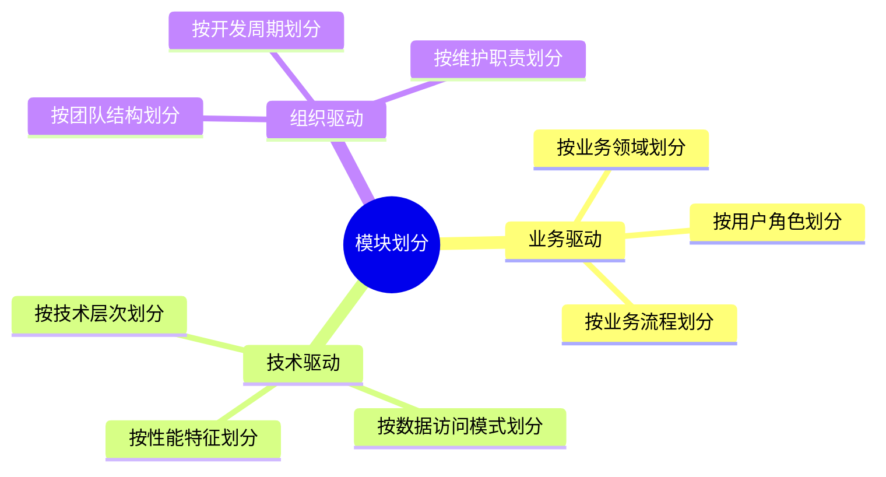
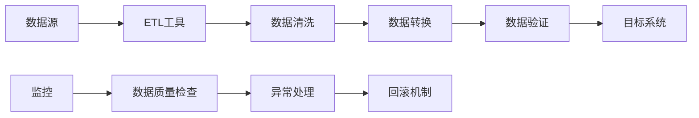
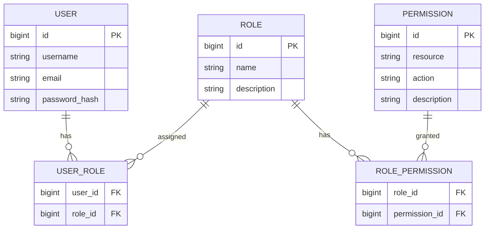

# 架构设计最佳实践指南

## 1. 架构设计原则

### 1.1 SOLID原则

#### 单一职责原则 (Single Responsibility Principle)
每个模块只负责一个功能领域，修改原因单一。

**实践要点:**
- 识别业务边界，明确职责划分
- 避免一个类承担过多责任
- 使用接口隔离不同职责

```java
// ❌ 违反单一职责原则
public class UserService {
    public User createUser(User user) { /* ... */ }
    public void sendEmail(User user, String message) { /* ... */ }
    public void logAudit(String action) { /* ... */ }
}

// ✅ 遵循单一职责原则
public class UserService {
    public User createUser(User user) { /* ... */ }
}

public class EmailService {
    public void sendEmail(User user, String message) { /* ... */ }
}

public class AuditService {
    public void logAudit(String action) { /* ... */ }
}
```

#### 开闭原则 (Open/Closed Principle)
对扩展开放，对修改封闭。

**实践要点:**
- 使用接口和抽象类定义扩展点
- 通过组合而非继承实现扩展
- 策略模式和模板方法模式的应用

#### 里氏替换原则 (Liskov Substitution Principle)
子类必须能够替换其基类而不影响程序正确性。

**实践要点:**
- 子类不能削弱基类的功能
- 子类可以扩展基类功能
- 避免违反子类型关系

#### 接口隔离原则 (Interface Segregation Principle)
客户端不应依赖于它不需要的接口。

**实践要点:**
- 接口设计要小而专一
- 避免大而全的接口
- 使用多个专门接口替代大接口

#### 依赖倒置原则 (Dependency Inversion Principle)
高层模块不应依赖低层模块，都应依赖抽象。

**实践要点:**
- 依赖注入(DI)和依赖查找(DL)
- 面向接口编程
- 抽象不应依赖细节

### 1.2 CAP原则

#### 一致性 (Consistency)
所有节点在同一时间看到相同的数据。

#### 可用性 (Availability)  
每次请求都能收到响应(非错误响应)。

#### 分区容错性 (Partition Tolerance)
系统在网络分区的情况下仍能继续运行。

**架构选择:**
- **CP系统**: 优先保证一致性和分区容错性
- **AP系统**: 优先保证可用性和分区容错性
- **CA系统**: 在没有网络分区的情况下保证一致性和可用性

### 1.3 DDD战略原则

#### 限界上下文 (Bounded Context)
明确定义业务模型的边界，避免概念混淆。

#### 通用语言 (Ubiquitous Language)
业务和技术团队使用统一的术语和概念。

#### 上下文映射 (Context Mapping)
定义不同限界上下文之间的关系和集成方式。

## 2. 系统设计最佳实践

### 2.1 模块化设计

#### 模块划分原则


#### 模块间通信模式
- **同步调用**: HTTP REST API, gRPC
- **异步消息**: 消息队列, 事件总线
- **共享数据**: 数据库, 缓存
- **文件交换**: 对象存储, 文件系统

### 2.2 接口设计

#### REST API设计规范
```yaml
# 资源命名规范
/users/{userId}           # 获取用户信息
/users/{userId}/orders    # 获取用户订单
/orders/{orderId}/items   # 获取订单项目

# HTTP方法使用
GET    /users             # 获取用户列表
POST   /users             # 创建新用户
PUT    /users/{id}        # 完整更新用户
PATCH  /users/{id}        # 部分更新用户
DELETE /users/{id}        # 删除用户

# 响应状态码
200 OK                    # 请求成功
201 Created               # 资源创建成功
400 Bad Request          # 请求参数错误
401 Unauthorized         # 未授权访问
404 Not Found            # 资源不存在
500 Internal Server Error # 服务器内部错误
```

#### API版本管理
- **URL版本**: `/api/v1/users`, `/api/v2/users`
- **Header版本**: `Accept: application/vnd.api+json;version=1`
- **参数版本**: `/users?version=1`
- **语义化版本**: 遵循SemVer规范

### 2.3 数据设计

#### 数据库设计原则
- **范式化**: 避免数据冗余，保证数据一致性
- **反范式化**: 优化查询性能，合理冗余
- **分区策略**: 按时间、地域、业务等进行数据分区
- **索引优化**: 基于查询模式建立合适索引

#### 数据迁移策略


## 3. 性能优化最佳实践

### 3.1 缓存策略

#### 多级缓存架构
```
请求 → L1缓存(内存) → L2缓存(Redis) → L3缓存(CDN) → 数据库
```

#### 缓存模式
- **Cache-Aside**: 应用代码管理缓存
- **Read-Through**: 缓存层管理数据加载
- **Write-Through**: 写入同时更新缓存
- **Write-Behind**: 异步写入后端存储

#### 缓存失效策略
```java
// 基于时间的失效策略
@Cacheable(value = "users", key = "#id", unless = "#result == null")
public User getUser(String id) {
    return userRepository.findById(id);
}

// 主动失效策略
@CacheEvict(value = "users", key = "#id")
public void updateUser(String id, User user) {
    userRepository.save(user);
}
```

### 3.2 数据库优化

#### 查询优化
- **索引优化**: 建立合适的索引，避免全表扫描
- **查询重写**: 避免复杂的子查询和连接
- **分页优化**: 使用游标分页替代偏移分页
- **批量操作**: 减少数据库往返次数

#### 连接池配置
```yaml
# HikariCP连接池配置
spring:
  datasource:
    hikari:
      maximum-pool-size: 20        # 最大连接数
      minimum-idle: 5              # 最小空闲连接
      idle-timeout: 300000         # 空闲超时时间
      max-lifetime: 1200000        # 连接最大生命周期
      connection-timeout: 30000    # 连接超时时间
```

### 3.3 并发处理

#### 线程池配置
```java
// 自定义线程池配置
@Configuration
public class ThreadPoolConfig {
    
    @Bean
    public ThreadPoolTaskExecutor taskExecutor() {
        ThreadPoolTaskExecutor executor = new ThreadPoolTaskExecutor();
        executor.setCorePoolSize(10);        // 核心线程数
        executor.setMaxPoolSize(50);         // 最大线程数
        executor.setQueueCapacity(200);      // 队列容量
        executor.setThreadNamePrefix("async-");
        executor.setRejectedExecutionHandler(new ThreadPoolExecutor.CallerRunsPolicy());
        return executor;
    }
}
```

#### 异步处理
```java
@Service
public class OrderService {
    
    @Async("taskExecutor")
    public CompletableFuture<Void> processOrderAsync(Order order) {
        // 异步处理订单
        orderProcessingService.process(order);
        return CompletableFuture.completedFuture(null);
    }
}
```

## 4. 安全设计最佳实践

### 4.1 认证和授权

#### JWT认证实现
```java
@Component
public class JwtTokenProvider {
    
    private final String secretKey;
    private final long validityInMilliseconds;
    
    public String createToken(UserPrincipal userDetails) {
        Claims claims = Jwts.claims().setSubject(userDetails.getUsername());
        claims.put("roles", userDetails.getAuthorities());
        
        Date now = new Date();
        Date validity = new Date(now.getTime() + validityInMilliseconds);
        
        return Jwts.builder()
            .setClaims(claims)
            .setIssuedAt(now)
            .setExpiration(validity)
            .signWith(SignatureAlgorithm.HS256, secretKey)
            .compact();
    }
}
```

#### RBAC权限模型


### 4.2 数据安全

#### 敏感数据加密
```java
@Component
public class DataEncryptionService {
    
    private final AESUtil aesUtil;
    
    public String encryptSensitiveData(String data) {
        return aesUtil.encrypt(data);
    }
    
    public String decryptSensitiveData(String encryptedData) {
        return aesUtil.decrypt(encryptedData);
    }
}
```

#### SQL注入防护
```java
// 使用参数化查询
@Repository
public class UserRepository {
    
    @Autowired
    private JdbcTemplate jdbcTemplate;
    
    public User findById(String id) {
        String sql = "SELECT * FROM users WHERE id = ?";
        return jdbcTemplate.queryForObject(sql, new UserRowMapper(), id);
    }
}
```

### 4.3 网络安全

#### HTTPS配置
```yaml
server:
  port: 443
  ssl:
    enabled: true
    key-store: classpath:keystore.p12
    key-store-password: ${SSL_KEYSTORE_PASSWORD}
    key-store-type: PKCS12
    key-alias: ${SSL_KEY_ALIAS}
```

#### 安全头配置
```java
@Configuration
public class SecurityHeadersConfig {
    
    @Bean
    public FilterRegistrationBean<SecurityHeadersFilter> securityHeadersFilter() {
        FilterRegistrationBean<SecurityHeadersFilter> registration = new FilterRegistrationBean<>();
        registration.setFilter(new SecurityHeadersFilter());
        registration.addUrlPatterns("/*");
        return registration;
    }
}
```

## 5. 可观测性最佳实践

### 5.1 监控体系

#### 三大支柱监控
1. **指标监控**: 系统和业务指标的收集和分析
2. **日志监控**: 结构化日志的收集和查询
3. **链路追踪**: 分布式系统的请求链路跟踪

#### 关键监控指标
```yaml
# 应用层指标
application_metrics:
  throughput:
    - name: requests_per_second
      type: counter
    - name: response_time_percentile
      type: histogram
  errors:
    - name: error_rate
      type: gauge
    - name: exception_count
      type: counter
      
# 系统层指标  
system_metrics:
  cpu:
    - name: cpu_usage_percent
      type: gauge
  memory:
    - name: memory_usage_bytes
      type: gauge
  disk:
    - name: disk_usage_percent
      type: gauge
```

### 5.2 日志管理

#### 结构化日志格式
```json
{
  "timestamp": "2024-01-01T12:00:00.000Z",
  "level": "INFO",
  "logger": "com.example.OrderService",
  "message": "Order processed successfully",
  "traceId": "abc123",
  "spanId": "def456",
  "userId": "user123",
  "orderId": "order456",
  "duration": 150,
  "metadata": {
    "service": "order-service",
    "version": "1.0.0",
    "environment": "production"
  }
}
```

#### 日志级别使用规范
- **ERROR**: 系统错误，需要立即关注
- **WARN**: 潜在问题，需要监控
- **INFO**: 重要的业务信息
- **DEBUG**: 调试信息，生产环境关闭

### 5.3 链路追踪

#### 分布式追踪实现
```java
@RestController
public class OrderController {
    
    @Autowired
    private Tracer tracer;
    
    @PostMapping("/orders")
    public ResponseEntity<Order> createOrder(@RequestBody Order order) {
        Span span = tracer.nextSpan().name("create-order");
        try (Tracer.SpanInScope ws = tracer.withSpanInScope(span)) {
            span.tag("user.id", order.getUserId());
            span.tag("order.amount", order.getAmount().toString());
            
            Order createdOrder = orderService.createOrder(order);
            
            span.tag("order.id", createdOrder.getId());
            span.event("order-created");
            
            return ResponseEntity.ok(createdOrder);
        } finally {
            span.end();
        }
    }
}
```

## 6. 部署运维最佳实践

### 6.1 容器化最佳实践

#### Dockerfile优化
```dockerfile
# 多阶段构建优化镜像大小
FROM maven:3.8-openjdk-17 AS builder
WORKDIR /app
COPY pom.xml .
RUN mvn dependency:go-offline
COPY src ./src
RUN mvn clean package -DskipTests

FROM openjdk:17-jre-slim
WORKDIR /app
COPY --from=builder /app/target/*.jar app.jar

# 创建非root用户
RUN addgroup --system --gid 1001 appgroup && \
    adduser --system --uid 1001 --gid 1001 appuser
USER appuser

EXPOSE 8080
ENTRYPOINT ["java", "-jar", "app.jar"]
```

#### 健康检查配置
```yaml
# Kubernetes健康检查
apiVersion: v1
kind: Deployment
metadata:
  name: user-service
spec:
  template:
    spec:
      containers:
      - name: user-service
        image: user-service:latest
        livenessProbe:
          httpGet:
            path: /actuator/health
            port: 8080
          initialDelaySeconds: 60
          periodSeconds: 30
        readinessProbe:
          httpGet:
            path: /actuator/health/readiness
            port: 8080
          initialDelaySeconds: 30
          periodSeconds: 10
```

### 6.2 CI/CD流水线

#### GitOps实践
```yaml
# GitOps工作流
stages:
  - code-quality
  - build
  - security-scan
  - deploy-staging
  - integration-test
  - deploy-production

code-quality:
  stage: code-quality
  script:
    - ./gradlew checkstyleMain
    - ./gradlew spotbugsMain
    - ./gradlew test

security-scan:
  stage: security-scan
  script:
    - docker run --rm -v $(pwd):/app clair-scanner:latest
    - trivy fs --exit-code 1 .

deploy-production:
  stage: deploy-production
  script:
    - helm upgrade --install user-service ./helm/user-service
  when: manual
```

### 6.3 配置管理

#### 配置外部化
```yaml
# application.yml
spring:
  profiles:
    active: ${SPRING_PROFILES_ACTIVE:dev}
  config:
    import: optional:configserver:${CONFIG_SERVER_URL:http://localhost:8888}
    
management:
  endpoints:
    web:
      exposure:
        include: health,info,metrics,prometheus
  endpoint:
    health:
      show-details: when-authorized
```

#### 密钥管理
```yaml
# Kubernetes Secret
apiVersion: v1
kind: Secret
metadata:
  name: database-credentials
type: Opaque
data:
  username: <base64-encoded-username>
  password: <base64-encoded-password>
  jdbc-url: <base64-encoded-jdbc-url>
```

## 7. 团队协作最佳实践

### 7.1 代码规范

#### 统一代码风格
```json
{
  "editor.formatOnSave": true,
  "editor.codeActionsOnSave": {
    "source.fixAll.eslint": true
  },
  "java.format.settings.url": "https://raw.githubusercontent.com/google/styleguide/gh-pages/eclipse-java-google-style.xml"
}
```

#### 代码审查清单
- [ ] 代码符合编码规范
- [ ] 单元测试覆盖率达标
- [ ] 安全漏洞检查通过
- [ ] 性能影响评估
- [ ] 文档更新完整
- [ ] 向后兼容性考虑

### 7.2 文档管理

#### 架构文档标准
- **架构决策记录(ADR)**: 记录重要技术决策
- **系统设计文档**: 详细的设计说明
- **API文档**: 接口规范和使用示例
- **运维手册**: 部署和故障处理指南

#### 知识分享机制
- 定期技术分享会
- 设计文档评审
- 代码走查活动
- 最佳实践总结