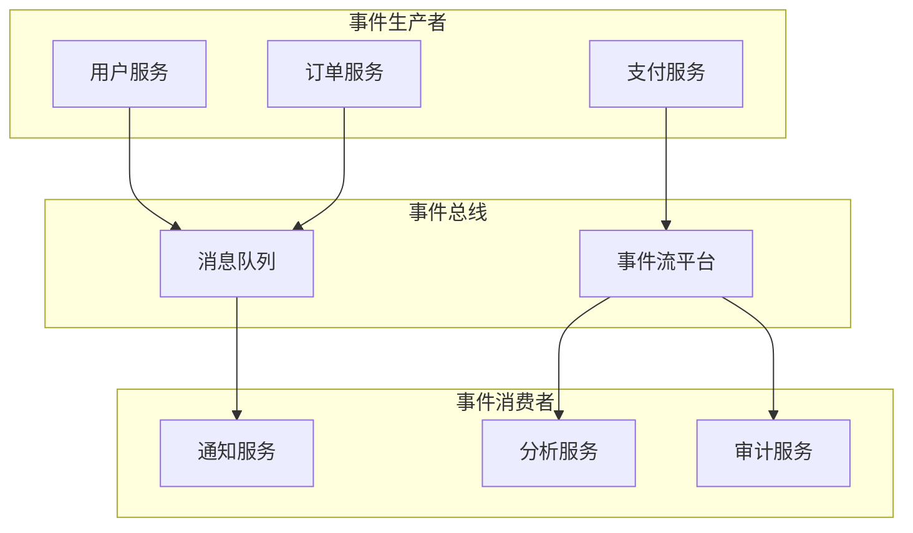
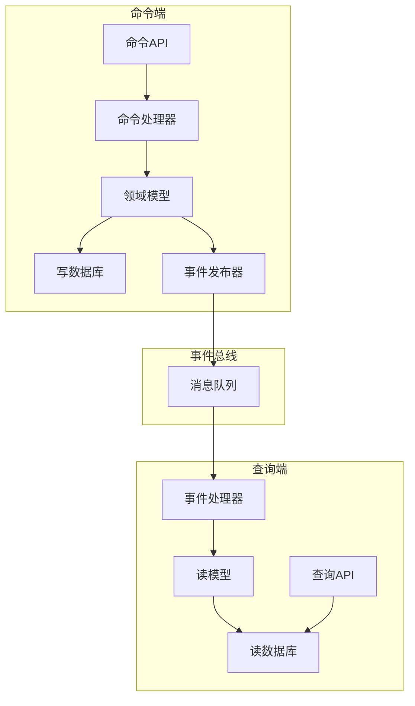
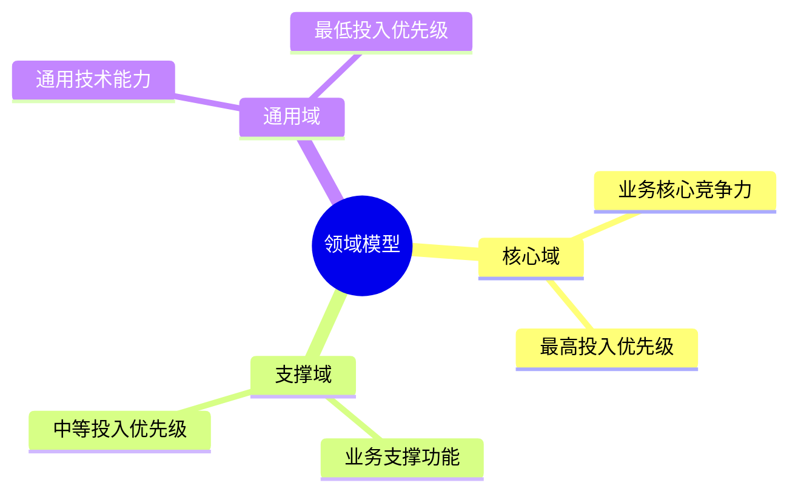
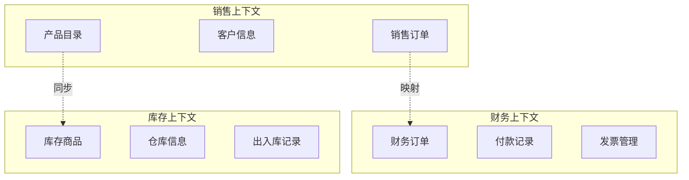
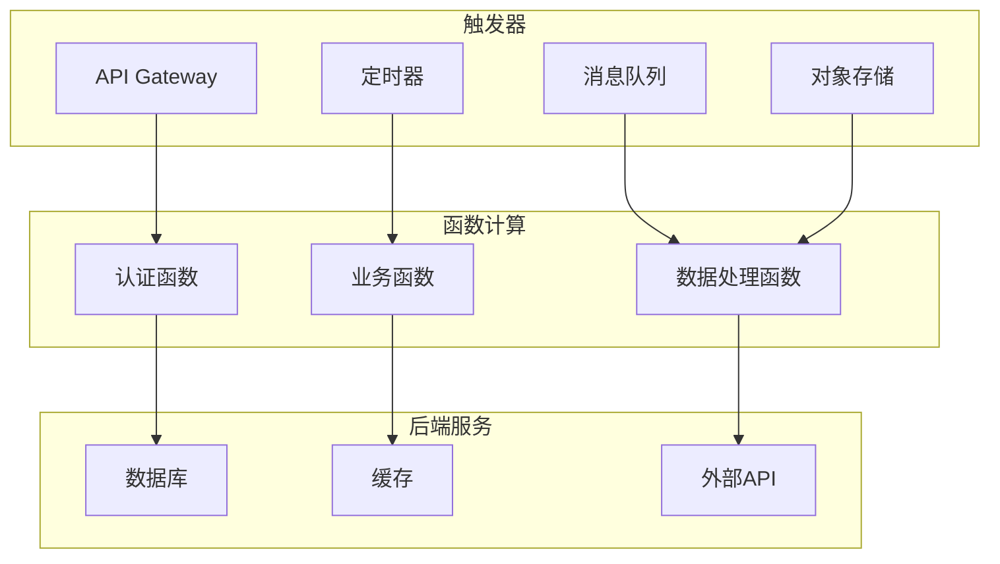
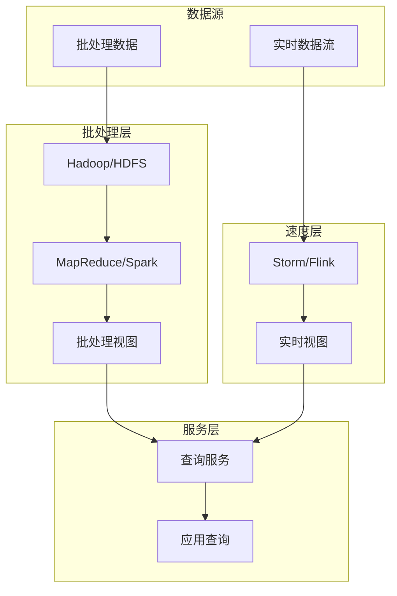
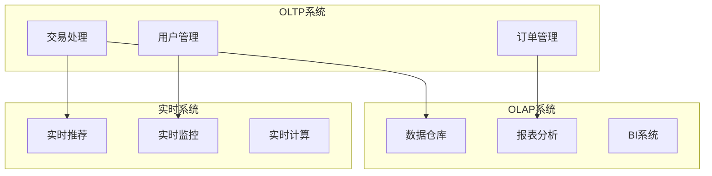

# 架构模式参考指南

## 1. 分层架构模式 (Layered Architecture)

### 1.1 模式描述
分层架构是将系统按照职责划分为多个层次，每层只与相邻层交互，实现关注点分离。

### 1.2 典型分层结构
```
┌─────────────────────┐
│    表示层 (UI)       │  用户界面和交互逻辑
├─────────────────────┤
│   应用层 (Service)   │  业务流程和用例编排
├─────────────────────┤
│   领域层 (Domain)    │  业务逻辑和领域模型
├─────────────────────┤
│  基础设施层 (Infra)  │  数据访问和外部服务
└─────────────────────┘
```

### 1.3 优缺点分析
**优点:**
- 职责清晰，易于理解和维护
- 层次之间松耦合，支持独立开发
- 可重用性高，层次可以复用

**缺点:**
- 可能过度设计，增加复杂性
- 层次限制可能影响性能
- 修改影响范围较大

### 1.4 适用场景
- 传统企业应用系统
- 业务逻辑相对稳定的应用
- 团队规模较大的项目

## 2. 微服务架构模式 (Microservices Architecture)

### 2.1 模式描述
将应用拆分为一组小型、独立的服务，每个服务负责特定的业务功能，可以独立开发、部署和扩展。

### 2.2 核心特征
- **服务单一职责**: 每个服务专注一个业务领域
- **独立部署**: 服务可独立开发、测试、部署
- **去中心化**: 避免单点故障，数据分散存储
- **容错性**: 服务隔离，优雅降级

### 2.3 技术要求
```yaml
微服务技术栈:
  服务注册发现: Consul, Eureka, Nacos
  API网关: Kong, Spring Cloud Gateway, APISIX
  服务通信: REST, gRPC, 消息队列
  配置中心: Apollo, Nacos, Spring Cloud Config
  熔断降级: Hystrix, Sentinel, Resilience4j
  链路追踪: Zipkin, Jaeger, SkyWalking
```

### 2.4 适用场景
- 业务复杂度高的系统
- 需要快速迭代和创新
- 团队规模较大的项目
- 对可用性要求高的系统

## 3. 事件驱动架构模式 (Event-Driven Architecture)

### 3.1 模式描述
基于事件的发布-订阅模式，系统组件通过事件进行异步通信，实现松耦合和可扩展性。

### 3.2 核心组件


### 3.3 事件设计原则
- **不可变性**: 事件内容不可修改
- **时间有序**: 包含时间戳信息
- **唯一标识**: 每个事件有唯一ID
- **因果关联**: 支持事件链追踪

### 3.4 技术选型
| 组件类型 | 开源方案 | 商业方案 | 云服务 |
|---------|---------|---------|--------|
| 消息队列 | RabbitMQ, ActiveMQ | IBM MQ | AWS SQS, Azure Service Bus |
| 事件流 | Apache Kafka | Confluent Platform | AWS Kinesis, Azure Event Hubs |
| 服务网格 | Istio, Linkerd | NGINX Service Mesh | AWS App Mesh, Azure Service Mesh |

## 4. CQRS模式 (Command Query Responsibility Segregation)

### 4.1 模式描述
将系统的读操作(查询)和写操作(命令)分离，使用不同的模型和数据存储来优化各自的性能。

### 4.2 架构设计


### 4.3 实现要点
- **数据同步**: 通过事件保持两端数据一致
- **最终一致性**: 允许短暂的数据不一致
- **性能优化**: 读写端可以独立优化和扩展

### 4.4 适用场景
- 读密集型应用
- 读写模式差异大的系统
- 需要复杂查询的业务场景
- 高并发读写系统

## 5. 六边形架构模式 (Hexagonal Architecture)

### 5.1 模式描述
将应用核心与外部依赖隔离，通过端口和适配器的模式实现技术无关性。

### 5.2 架构结构
```
         ┌─────────────────┐
         │   应用核心      │
         │  (业务逻辑)     │
         └─────────┬───────┘
      ┌──────────┴──────────┐
      │        端口         │
      │   (接口定义)        │
      └──────────┬──────────┘
   ┌─────────────┴─────────────┐
   │          适配器           │
   │  (数据库、API、消息队列等) │
   └───────────────────────────┘
```

### 5.3 核心概念
- **端口(Port)**: 定义接口和契约
- **适配器(Adapter)**: 实现端口接口，连接外部系统
- **核心(Core)**: 纯业务逻辑，不依赖外部技术

### 5.4 实现示例
```java
// 端口接口定义
public interface UserRepository {
    User findById(String id);
    void save(User user);
    void delete(String id);
}

// 适配器实现
public class DatabaseUserRepository implements UserRepository {
    private final JdbcTemplate jdbcTemplate;
    
    @Override
    public User findById(String id) {
        return jdbcTemplate.queryForObject(
            "SELECT * FROM users WHERE id = ?", 
            new UserRowMapper(), 
            id
        );
    }
}
```

## 6. 领域驱动设计模式 (Domain-Driven Design)

### 6.1 核心概念
- **实体(Entity)**: 具有唯一标识的对象
- **值对象(Value Object)**: 没有标识的不可变对象
- **聚合(Aggregate)**: 数据修改的单元
- **仓储(Repository)**: 聚合的持久化抽象
- **领域服务(Domain Service)**: 不属于实体或值对象的业务逻辑

### 6.2 战略设计


### 6.3 限界上下文 (Bounded Context)


## 7. 云原生架构模式 (Cloud-Native Architecture)

### 7.1 核心特征
- **容器化**: 使用容器打包应用
- **微服务**: 服务化架构设计
- **DevOps**: 自动化运维流程
- **持续交付**: 快速迭代部署

### 7.2 技术栈
```yaml
容器技术:
  容器运行时: Docker, containerd
  编排平台: Kubernetes, Docker Swarm
  服务网格: Istio, Linkerd
  
云原生存储:
  对象存储: MinIO, Ceph
  分布式文件: GlusterFS, HDFS
  数据库: CockroachDB, TiDB
  
监控可观测性:
  指标监控: Prometheus, Thanos
  日志收集: Fluentd, Loki
  链路追踪: Jaeger, Zipkin
```

### 7.3 部署模式
- **蓝绿部署**: 零停机切换
- **金丝雀发布**: 渐进式流量切换
- **滚动更新**: 逐步替换实例
- **A/B测试**: 基于功能的流量分发

## 8. 无服务器架构模式 (Serverless Architecture)

### 8.1 模式描述
将应用逻辑拆分为独立的函数，由云平台自动管理资源分配和扩展。

### 8.2 架构组件


### 8.3 优缺点分析
**优点:**
- 按需付费，成本优化
- 自动扩展，无需运维
- 快速开发部署

**缺点:**
- 冷启动延迟
- 执行时间限制
- 调试困难
- 厂商锁定风险

### 8.4 适用场景
- 事件驱动型应用
- 间歇性负载应用
- 快速原型开发
- API网关后端服务

## 9. 大数据架构模式

### 9.1 Lambda架构


### 9.2 Kappa架构
- 简化版Lambda架构
- 只保留流处理层
- 数据重新处理通过重放事件实现

### 9.3 技术选型
| 层次 | 开源技术 | 云服务 |
|-----|---------|--------|
| 数据采集 | Flume, Logstash | AWS Kinesis, Azure Event Hubs |
| 数据存储 | HDFS, Cassandra | AWS S3, Azure Data Lake |
| 批处理 | Spark, Flink | AWS EMR, Azure HDInsight |
| 流处理 | Flink, Spark Streaming | AWS Kinesis Data Analytics |
| 数据查询 | Presto, Druid | AWS Athena, Azure Synapse |

## 10. 混合架构模式

### 10.1 混合云架构
- 私有云处理核心业务
- 公有云处理弹性业务
- 数据同步和灾备

### 10.2 多模架构


### 10.3 模式选择指导原则
1. **业务需求优先**: 根据业务特点选择合适模式
2. **技术团队能力**: 考虑团队技术栈和学习成本
3. **性能要求**: 满足性能和扩展性要求
4. **成本控制**: 平衡技术复杂度和实施成本
5. **演进能力**: 支持系统持续演进和优化