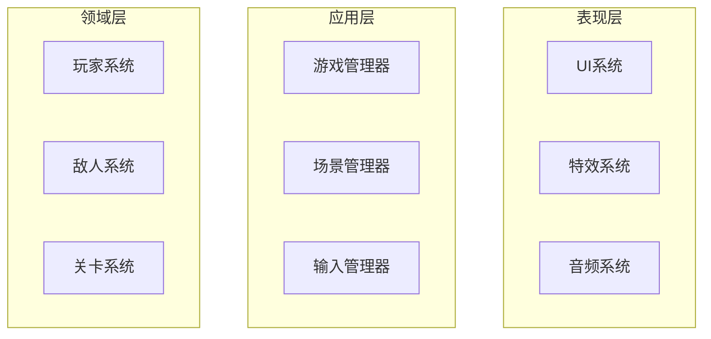

# Godot 2D游戏架构设计技能

## 技能概述

这是一个专业的Godot 2D游戏架构设计技能，提供系统化的游戏架构规划、场景结构设计、节点组织模式、信号通信架构、资源管理策略和状态机设计。

### 主要功能

- **架构模式设计**: 单例模式、组件实体模式、命令模式、状态机模式、工厂模式
- **系统架构规划**: 输入系统、渲染系统、物理系统、音频系统、UI系统等核心系统设计
- **组件化开发**: 基于组件的实体系统设计，提高代码复用性和可维护性
- **图表生成**: 自动生成Mermaid架构图、流程图、状态图等可视化文档
- **代码规范**: 提供Godot项目的最佳实践和命名规范
- **性能优化**: 内存管理、渲染优化、对象池等性能优化策略

## 使用方法

### 基本用法

当您需要设计Godot 2D游戏架构时，直接描述您的需求：

```
"设计一个2D平台跳跃游戏的架构，包含玩家控制、敌人AI、道具系统和关卡管理"
```

### 详细用法示例

```
"我需要为一个Godot 2D RPG游戏设计架构，要求包括：
1. 玩家角色系统（移动、战斗、背包）
2. 敌人AI系统（巡逻、追击、攻击）
3. 物品道具系统（装备、消耗品）
4. UI界面系统（主菜单、游戏界面、背包界面）
5. 存档系统
6. 音频系统

请提供完整的架构设计文档，包含系统图表和组件说明。"
```

## 技能输出内容

### 1. 架构设计文档

- **文字说明**: 详细的设计思路、技术选型理由、实现策略
- **架构表格**: 系统组件职责、接口定义、依赖关系
- **Mermaid图表**: 
  - 系统架构图
  - 组件关系图  
  - 状态机图
  - 数据流图
  - 序列图
  - 类图
  - 甘特图

### 2. 代码模板

提供常用的Godot代码模板：

```gdscript
# 玩家控制器示例
extends CharacterBody2D
class_name PlayerController

@onready var health_component = $HealthComponent
@onready var movement_component = $MovementComponent
@onready var combat_component = $CombatComponent

func _ready():
    health_component.health_depleted.connect(_on_death)

func _physics_process(delta):
    movement_component.move(Input.get_vector("move_left", "move_right", "move_up", "move_down"), delta)

func _on_death():
    game_over.emit()
```

### 3. 项目结构建议

```
project/
├── scenes/           # 场景文件
│   ├── ui/
│   ├── levels/
│   └── entities/
├── scripts/          # 脚本文件
│   ├── managers/     # 管理器脚本
│   ├── components/   # 组件脚本
│   ├── entities/     # 实体脚本
│   └── ui/          # UI脚本
├── assets/          # 资源文件
│   ├── textures/
│   ├── sounds/
│   └── fonts/
└── resources/       # 资源文件
```

## 支持的架构模式

### 1. 单例模式 (Singleton)
适用于全局管理器：
- GameManager - 游戏状态管理
- InputManager - 输入管理
- AudioManager - 音频管理
- SceneManager - 场景管理

### 2. 组件实体模式 (Component Entity)
适用于复杂游戏对象：
- Player - 玩家实体
- Enemy - 敌人实体
- NPC - 非玩家角色
- InteractiveObject - 可交互对象

### 3. 状态机模式 (State Machine)
适用于状态管理：
- PlayerStateMachine - 玩家状态
- EnemyStateMachine - 敌人AI状态
- GameStateMachine - 游戏流程状态
- UIStateMachine - UI状态

### 4. 命令模式 (Command Pattern)
适用于输入处理：
- InputCommand - 输入命令
- MoveCommand - 移动命令
- AttackCommand - 攻击命令
- UseAbilityCommand - 技能命令

## 开发规范

### 命名规范
- **场景文件**: PascalCase (Player.tscn, MainMenu.tscn)
- **脚本文件**: PascalCase (Player.gd, GameManager.gd)  
- **变量**: snake_case (player_health, max_speed)
- **常量**: UPPER_CASE (MAX_HEALTH, GRAVITY)
- **信号**: snake_case (health_changed, level_completed)
- **函数**: snake_case (take_damage, initialize_player)

### 代码组织
- 使用组件化设计
- 优先使用信号通信
- 避免全局变量
- 合理使用单例模式
- 注重性能优化

## 性能优化建议

### 渲染优化
- 使用纹理图集减少DrawCall
- 实现LOD系统
- 视锥剔除优化
- 对象池化

### 内存管理
- 及时释放不用的资源
- 避免循环引用
- 使用弱引用
- 合理的预加载策略

### 代码优化
- 减少不必要的计算
- 缓存频繁访问的节点引用
- 使用碰撞层优化物理检测
- 避免在_process中创建对象

## 工具和脚本

技能包含以下实用工具：

### 1. 架构验证工具 (architecture_validator.py)
- 验证架构文档完整性
- 检查项目结构规范性
- 生成架构分析报告

### 2. Mermaid图表生成器 (mermaid_generator.py)
- 自动生成各种架构图表
- 支持多种图表类型
- 可视化系统关系

### 3. 技能打包工具 (package_skill.py)
- 打包技能为.skill文件
- 验证技能完整性
- 生成技能元数据

## 示例输出

当您询问"设计一个2D平台游戏架构"时，技能将输出：

### 系统架构图


### 组件表格
| 组件 | 职责 | 接口 | 依赖 |
|------|------|------|------|
| PlayerController | 玩家主控制 | move(), jump(), attack() | Input, Movement, Combat |
| HealthComponent | 生命值管理 | take_damage(), heal() | - |
| MovementComponent | 移动控制 | move_direction(), jump() | - |

### 详细设计文档
包含每个系统的详细设计说明、实现建议、注意事项等。

## 最佳实践

1. **先设计后实现**: 在编写代码前先完成架构设计
2. **模块化设计**: 将复杂系统拆分为独立模块
3. **接口设计**: 定义清晰的组件接口
4. **测试友好**: 设计易于测试的架构
5. **可扩展性**: 预留扩展接口和配置选项
6. **文档完整**: 维护详细的架构文档

## 常见问题

### Q: 如何选择合适的架构模式？
A: 根据具体需求选择：
- 全局管理功能使用单例模式
- 复杂游戏对象使用组件实体模式  
- 状态复杂的使用状态机模式
- 输入处理使用命令模式

### Q: 组件间如何通信？
A: 推荐使用信号通信：
- 避免直接引用
- 松耦合设计
- 易于测试和维护

### Q: 如何处理性能问题？
A: 从架构层面考虑：
- 对象池化减少GC压力
- 合理的加载卸载策略
- 批量处理相似操作
- 距离相关的优化策略

---

**版本**: 1.0  
**作者**: Godot架构设计师  
**更新日期**: 2024年