# Godot 2D游戏架构设计文档模板

## 项目概述

**项目名称**: [游戏名称]
**游戏类型**: [类型如：平台动作、RPG、塔防等]
**目标平台**: [平台如：PC、移动端、网页等]
**技术要求**: [特殊技术需求]

---

## 1. 架构设计总览

### 1.1 核心设计原则

- **模块化**: 系统间低耦合，高内聚
- **可扩展**: 支持内容扩展和功能增强
- **性能优先**: 帧率稳定，内存占用合理
- **开发效率**: 便于团队协作和快速迭代

### 1.2 系统架构图

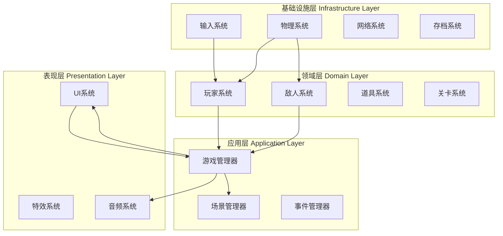

---

## 2. 核心系统设计

### 2.1 游戏管理器 (Game Manager)

| 功能 | 职责 | 依赖 | 接口 |
|------|------|------|------|
| 状态管理 | 游戏主状态控制 | 无 | change_state(), get_state() |
| 流程控制 | 关卡切换、游戏循环 | SceneManager | load_level(), restart_level() |
| 分数系统 | 得分计算、排行榜 | SaveSystem | add_score(), get_high_score() |
| 设置管理 | 游戏配置保存 | SaveSystem | save_settings(), load_settings() |

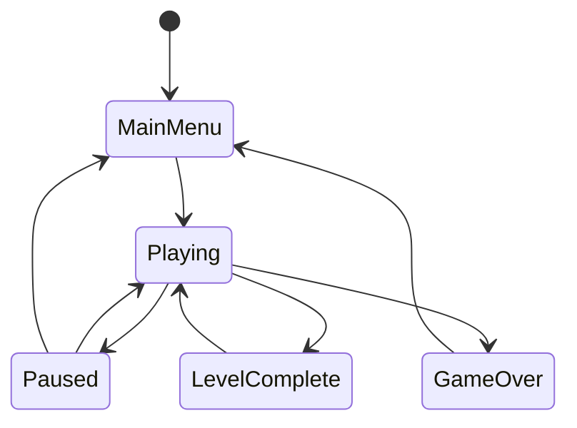

### 2.2 场景管理系统

| 场景类型 | 文件路径 | 主要功能 | 依赖组件 |
|----------|----------|----------|----------|
| 主菜单 | scenes/ui/MainMenu.tscn | 游戏入口、设置选择 | UIController, AudioManager |
| 游戏关卡 | scenes/levels/Level_*.tscn | 关卡游戏主体 | PlayerController, EnemyManager, LevelManager |
| 暂停界面 | scenes/ui/PauseMenu.tscn | 游戏暂停、选项设置 | UIController |
| 游戏结束 | scenes/ui/GameOver.tscn | 结果显示、重新开始 | UIController, ScoreManager |

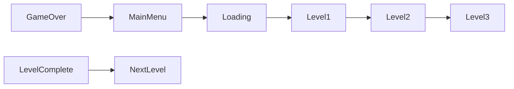

### 2.3 输入系统架构

| 输入类型 | 处理方式 | 映射配置 | 响应系统 |
|----------|----------|----------|----------|
| 键盘输入 | InputMap + 事件处理 | 可配置键位绑定 | PlayerController, UIController |
| 鼠标输入 | 鼠标事件监听 | 按键映射 | CameraController, UIController |
| 手柄输入 | 手柄按键映射 | 按键配置 | PlayerController |
| 触屏输入 | 触摸手势识别 | 手势配置 | UIController, PlayerController |

---

## 3. 实体系统架构

### 3.1 玩家系统组件

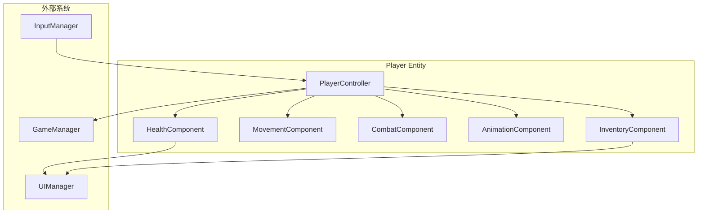

| 组件 | 主要功能 | 接口方法 | 信号输出 |
|------|----------|----------|----------|
| PlayerController | 玩家主控制器 | _ready(), _process(), _input() | player_died, level_completed |
| HealthComponent | 生命值管理 | take_damage(), heal(), get_health() | health_changed, health_depleted |
| MovementComponent | 移动控制 | move(), jump(), dash() | movement_started, position_changed |
| CombatComponent | 战斗系统 | attack(), use_ability() | attack_started, ability_used |
| AnimationComponent | 动画控制 | play(), play_by_state() | animation_started, animation_finished |
| InventoryComponent | 物品栏管理 | add_item(), remove_item(), use_item() | item_added, item_used |

### 3.2 敌人系统架构

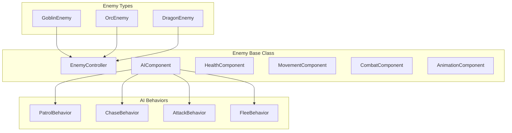

| 敌人类型 | 特殊能力 | 行为模式 | 掉落物品 |
|----------|----------|----------|----------|
| 哥布林 | 快速移动、群体攻击 | 巡逻 → 追击 → 攻击 | 金币、生命药水 |
| 兽人 | 重击、防御姿态 | 守护 → 冲撞 | 武器、护甲 |
| 飞龙 | 飞行、火焰吐息 | 空中巡逻 → 俯冲攻击 | 龙鳞、魔法宝石 |

### 3.3 道具系统架构

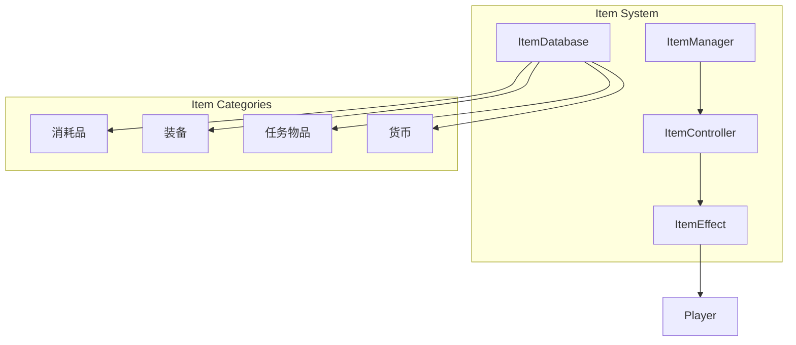

| 道具类型 | 效果类型 | 持续时间 | 使用方式 |
|----------|----------|----------|----------|
| 生命药水 | 恢复生命值 | 瞬时 | 点击使用 |
| 力量药剂 | 增强攻击力 | 60秒 | 点击使用 |
| 魔法卷轴 | 施放法术 | 瞬时 | 点击使用 |
| 钥匙 | 开启门锁 | 永久 | 自动使用 |

---

## 4. 界面系统架构

### 4.1 UI层级结构

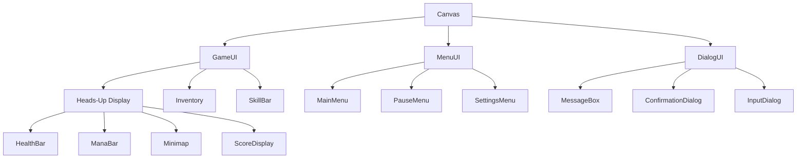

| UI层级 | 用途 | 响应优先级 | 更新频率 |
|--------|------|------------|----------|
| GameUI | 游戏中界面 | 中 | 每帧更新 |
| MenuUI | 菜单界面 | 高 | 事件驱动 |
| DialogUI | 对话框 | 最高 | 事件驱动 |

### 4.2 UI状态管理

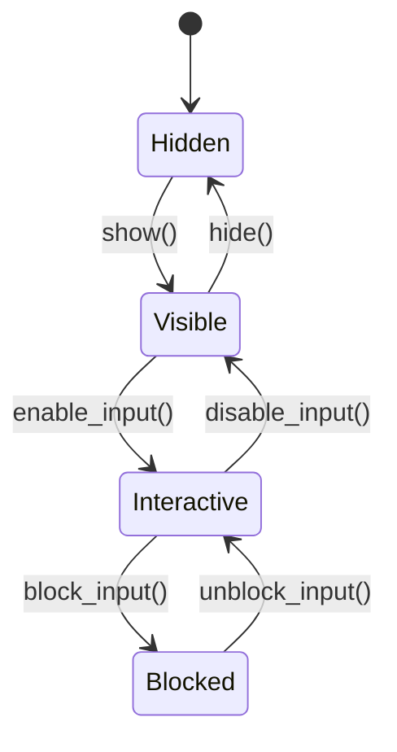

---

## 5. 数据架构设计

### 5.1 游戏数据模型

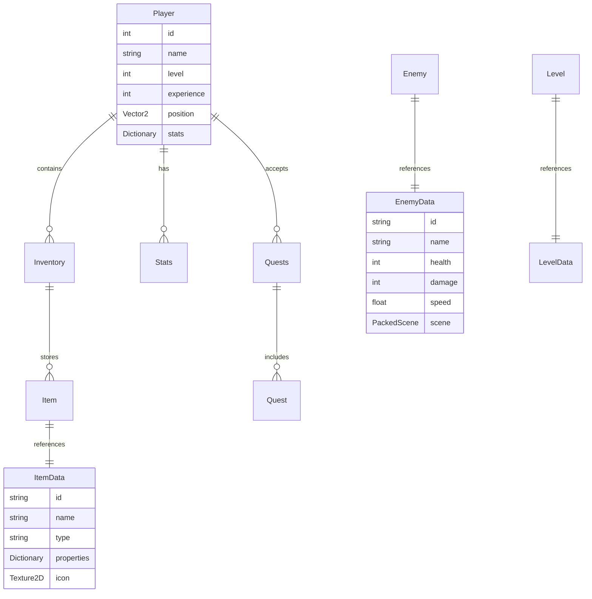

### 5.2 存档系统设计

| 存档类型 | 存储内容 | 保存频率 | 文件大小 |
|----------|----------|----------|----------|
| 快速存档 | 当前关卡状态、玩家位置 | 手动触发 | ~50KB |
| 自动存档 | 关卡进度、收集品 | 关卡完成时 | ~100KB |
| 设置存档 | 游戏设置、键位配置 | 设置改变时 | ~10KB |
| 成就存档 | 成就进度、统计数据 | 成就解锁时 | ~20KB |

---

## 6. 性能优化策略

### 6.1 渲染优化

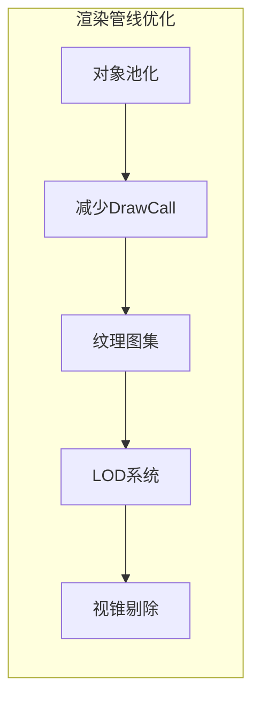

| 优化策略 | 实施方式 | 性能提升 | 实施难度 |
|----------|----------|----------|----------|
| 对象池 | 重用子弹、特效对象 | 30-50% | 中等 |
| 纹理图集 | 合并小纹理 | 20-30% | 简单 |
| LOD系统 | 距离相关细节层次 | 15-25% | 困难 |
| 批量渲染 | 合并相似对象 | 25-40% | 中等 |

### 6.2 内存管理

| 资源类型 | 加载策略 | 卸载时机 | 内存优化 |
|----------|----------|----------|----------|
| 场景资源 | 异步预加载 | 场景切换后 | 60-80% |
| 纹理资源 | 按需加载 | 不可见时 | 40-60% |
| 音频资源 | 流式加载 | 播放结束 | 20-30% |
| 脚本资源 | 预编译 | 游戏结束 | 10-15% |

---

## 7. 开发规范

### 7.1 代码规范

| 规范类型 | 具体要求 | 示例 |
|----------|----------|------|
| 命名规范 | 类名PascalCase，变量名snake_case | `class_name PlayerController`, `var player_health` |
| 文件组织 | 按功能模块分组 | `scenes/player/`, `scripts/managers/` |
| 注释规范 | 公共方法必须有文档注释 | `## 计算伤害值<br>## @param base_damage 基础伤害` |
| 版本控制 | 提交信息使用中文，格式统一 | `feat: 添加玩家跳跃功能` |

### 7.2 性能规范

| 指标要求 | 具体数值 | 测试方法 |
|----------|----------|----------|
| 帧率 | ≥60 FPS | Godot性能监视器 |
| 内存占用 | ≤500MB | 任务管理器 |
| 加载时间 | ≤3秒 | 计时器测试 |
| 网络延迟 | ≤100ms | ping测试 |

---

## 8. 测试策略

### 8.1 测试金字塔

```mermaid
pyramid
    title 测试金字塔
    top E2E Tests
    middle Integration Tests
    bottom Unit Tests
```

| 测试类型 | 测试内容 | 覆盖率目标 | 执行频率 |
|----------|----------|------------|----------|
| 单元测试 | 组件功能测试 | 80%+ | 每次构建 |
| 集成测试 | 系统交互测试 | 60%+ | 每日 |
| 端到端测试 | 完整游戏流程 | 关键路径100% | 发布前 |

### 8.2 自动化测试

```gdscript
# 自动化测试示例
func test_player_combat_flow():
    # Arrange
    var player = _create_test_player()
    var enemy = _create_test_enemy()
    
    # Act
    player.attack(enemy)
    
    # Assert
    assert(enemy.health < enemy.max_health)
    assert(player.combat_component.is_attacking == false)
```

---

## 9. 部署和发布

### 9.1 构建配置

| 平台 | 导出设置 | 优化级别 | 包大小限制 |
|------|----------|----------|------------|
| Windows | DirectX 11, 64位 | 高 | ≤500MB |
| Android | OpenGL ES3, ARM64 | 中 | ≤200MB |
| Web | WebGL2, 压缩模式 | 低 | ≤50MB |

### 9.2 发布检查清单

- [ ] 所有核心功能正常运行
- [ ] 性能指标达到要求
- [ ] 兼容性测试通过
- [ ] 安全性检查完成
- [ ] 文档和帮助内容完整
- [ ] 版本号和更新日志正确
- [ ] 法规合规性检查通过

---

## 10. 项目时间线

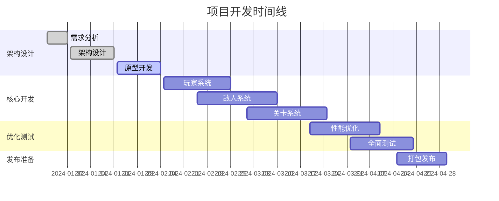

---

## 附录

### A. 技术选型理由

| 技术选项 | 选用理由 | 备选方案 | 拒绝原因 |
|----------|----------|----------|----------|
| Godot 4.x | 开源免费、2D功能完善、GDScript易用 | Unity | 商业授权成本高 |
| C#混合编程 | 性能关键部分使用C# | 纯GDScript | C#性能优势明显 |
| 对象池模式 | 减少GC压力，提升帧率 | 实时创建销毁 | 内存碎片问题 |

### B. 风险评估

| 风险项 | 风险等级 | 影响 | 应对策略 |
|--------|----------|------|----------|
| 性能不达标 | 中 | 影响玩家体验 | 早期性能测试，分步优化 |
| 技术难点阻塞 | 高 | 项目延期 | 技术预研，准备备选方案 |
| 需求变更 | 中 | 重新设计 | 模块化设计，预留扩展接口 |

### C. 参考资料

- [Godot官方文档](https://docs.godotengine.org/)
- [Godot最佳实践指南](https://godotengine.org/asset-library/asset)
- [游戏设计模式](https://gameprogrammingpatterns.com/)
- [2D游戏优化技术](https://docs.godotengine.org/en/stable/tutorials/performance/index.html)

---

**文档版本**: v1.0  
**最后更新**: 2024年XX月XX日  
**负责人**: [架构师姓名]  
**审核人**: [技术负责人姓名]