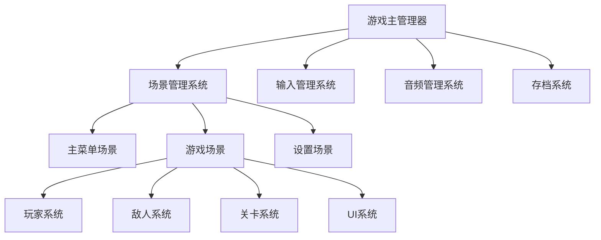

# Godot 2D游戏详细设计技能

## 技能概述

本技能专注于Godot 2D游戏的详细架构设计，能够基于已有的架构设计文档或游戏概念，进行深度的模块化设计、技术实现规划和详细文档输出。

### 核心能力

1. **模块化架构设计** - 基于功能需求进行系统模块分解和设计
2. **技术实现规划** - 提供符合Godot 2D范式的技术实现方案
3. **数据结构设计** - 设计合理的数据结构和接口定义
4. **性能优化建议** - 提供针对性的性能优化策略
5. **文档标准化输出** - 输出专业的架构设计文档

## 使用指南

### 触发条件

当遇到以下场景时使用此技能：

1. **架构文档完善** - 需要将概念设计转换为详细技术架构
2. **模块设计** - 需要设计具体的功能模块和技术实现
3. **技术选型** - 需要确定具体的技术方案和实现方式
4. **接口设计** - 需要定义模块间的接口和通信方式
5. **性能规划** - 需要考虑性能优化和技术限制

### 输入要求

使用此技能需要提供：

1. **游戏类型和核心玩法** - 明确游戏的类型和主要玩法机制
2. **功能需求列表** - 详细的功能需求说明
3. **技术限制条件** - 目标平台、性能要求等技术约束
4. **已有设计文档** - 如果存在，提供现有的架构或设计文档

### 设计流程

#### 阶段1: 需求分析和架构规划

1. **理解游戏概念**
   - 分析游戏类型（平台跳跃、RPG、射击、解谜等）
   - 确定核心玩法机制
   - 识别技术挑战和限制

2. **模块识别和分解**
   - 基于功能需求识别主要模块
   - 确定模块间的依赖关系
   - 定义模块边界和职责

#### 阶段2: 详细架构设计

1. **场景结构设计**
   - 设计场景层次结构
   - 确定可重用场景和组件
   - 规划场景加载和管理策略

2. **组件系统设计**
   - 设计组件接口和通信机制
   - 确定组件组合方式
   - 定义组件生命周期管理

3. **数据流架构设计**
   - 设计数据存储和管理策略
   - 确定数据流动路径
   - 定义数据验证和错误处理机制

#### 阶段3: 技术实现规划

1. **技术选型**
   - 选择合适的Godot节点类型
   - 确定脚本组织方式
   - 选择合适的设计模式

2. **性能优化策略**
   - 识别潜在性能瓶颈
   - 设计对象管理和内存策略
   - 规划渲染优化方案

#### 阶段4: 文档输出

按照以下结构输出详细的架构设计文档：

## 设计文档模板

### 1. 系统架构图

使用mermaid图表展示整体系统架构：



### 2. 模块详细设计表

| 模块名称 | 功能描述 | 核心类/脚本 | 依赖关系 | 关键接口 | 复杂度 |
|---------|---------|------------|---------|---------|--------|
| PlayerController | 玩家整体控制逻辑 | PlayerController.gd | InputManager, AnimationManager | handle_input(), update_state() | 高 |
| EnemyAI | 敌人AI行为控制 | EnemyAI.gd | PlayerController, Pathfinding | set_target(), execute_behavior() | 中 |
| LevelManager | 关卡流程管理 | LevelManager.gd | SceneManager, SaveSystem | load_level(), complete_level() | 中 |

### 3. 数据结构设计

#### 核心数据类
```gdscript
# PlayerData.gd
extends Resource
class_name PlayerData

@export var position: Vector2 = Vector2.ZERO
@export var health: int = 100
@export var max_health: int = 100
@export var inventory: Array[ItemData] = []
@export var abilities: Array[String] = []
```

#### 配置数据结构
```gdscript
# LevelConfig.gd
extends Resource
class_name LevelConfig

@export var level_name: String = ""
@export var tilemap_path: String = ""
@export var enemy_spawns: Array[EnemySpawnData] = []
@export var collectibles: Array[CollectibleData] = []
```

### 4. 接口和信号定义

#### 核心接口
```gdscript
# IInteractable.gd
extends RefCounted

func interact(player: Node):
    pass

func can_interact(player: Node) -> bool:
    return true
```

#### 事件信号
```gdsignal
signal player_health_changed(new_health: int)
signal game_paused()
signal level_completed(level_number: int)
```

### 5. 性能优化策略

| 优化类型 | 具体措施 | 预期效果 | 实现难度 |
|---------|---------|---------|---------|
| 对象池 | 频繁创建销毁的对象使用对象池 | 减少GC压力 | 中 |
| 批处理 | 相似渲染操作合并处理 | 提高渲染效率 | 高 |
| LOD系统 | 距离相关的细节层次 | 优化渲染性能 | 高 |

### 6. 扩展性设计

- **插件系统**: 预留插件接口支持功能扩展
- **配置驱动**: 游戏参数通过配置文件管理
- **模块化设计**: 支持模块的独立开发和测试

## 参考资源

### 设计模式参考
- **单例模式**: 全局管理器类设计
- **状态机**: 玩家和敌人状态管理
- **观察者模式**: 事件系统设计
- **工厂模式**: 对象创建和管理
- **对象池模式**: 性能优化

### Godot 2D最佳实践
- **节点组织**: 合理的节点层次结构
- **信号驱动**: 松耦合的模块通信
- **资源管理**: 高效的资源加载和释放策略
- **输入处理**: 响应式的输入管理系统
- **动画系统**: 流畅的动画状态管理

详细的设计模式和最佳实践请参考：
- [references/godot-2d-patterns.md](references/godot-2d-patterns.md)
- [references/architecture-templates.md](references/architecture-templates.md)
- [references/design-workflows.md](references/design-workflows.md)

### 设计示例
完整的游戏设计示例请参考：
- [assets/design-examples.md](assets/design-examples.md)

## 使用示例

### 示例1: 平台跳跃游戏设计

**用户需求**:
"我需要设计一个2D平台跳跃游戏的详细架构，包含玩家控制、敌人AI、关卡系统等核心功能。"

**设计输出**:
1. 系统架构图（使用mermaid）
2. 核心模块设计表
3. 玩家控制系统详细设计
4. 敌人AI系统架构
5. 关卡数据结构设计
6. 性能优化策略

### 示例2: RPG游戏系统设计

**用户需求**:
"基于这个RPG游戏概念，我需要详细的任务系统、战斗系统和物品系统的架构设计。"

**设计输出**:
1. RPG系统整体架构
2. 任务系统详细设计
3. 回合制战斗系统架构
4. 物品和装备系统设计
5. 存档系统设计

## API查询支持

对于不确定的Godot API或技术细节，使用context7工具查询最新文档：

```
当遇到特定技术问题时，使用：
- 查询Godot 4.x相关API文档
- 查询特定节点类型的使用方法
- 查询性能优化最佳实践
- 查询平台特定注意事项
```

## 质量保证

### 设计原则
- **可维护性**: 清晰的模块划分和接口定义
- **可扩展性**: 预留扩展接口和配置化设计
- **性能优化**: 考虑目标平台的性能限制
- **代码复用**: 设计可重用的组件和场景

### 验证检查点
- [ ] 模块职责清晰，没有重叠
- [ ] 接口定义完整，参数合理
- [ ] 数据结构设计合理，扩展性好
- [ ] 考虑了性能优化策略
- [ ] 文档结构完整，易于理解

通过以上流程和模板，可以为Godot 2D游戏项目提供专业、详细的架构设计服务。