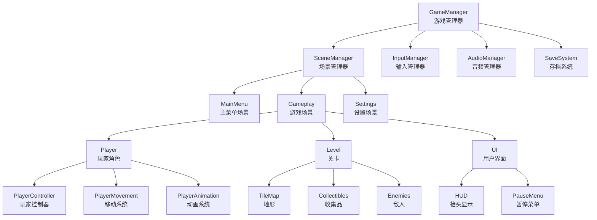
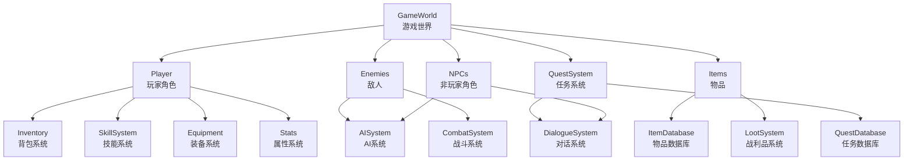
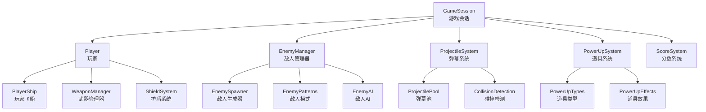

# Godot 2D游戏设计示例

## 示例1: 2D平台跳跃游戏架构

### 系统架构图


### 模块详细设计表

#### 核心系统模块

| 模块名称 | 功能描述 | 核心类/脚本 | 依赖关系 | 关键接口 | 复杂度 |
|---------|---------|------------|---------|---------|--------|
| GameManager | 全局游戏状态管理 | GameManager.gd | SceneManager, SaveSystem | start_game(), pause_game(), game_over() | 高 |
| SceneManager | 场景切换管理 | SceneManager.gd | 无 | change_scene(), preload_scene() | 中 |
| InputManager | 输入处理管理 | InputManager.gd | 无 | get_input(), register_action() | 中 |
| AudioManager | 音频播放管理 | AudioManager.gd | 无 | play_bgm(), play_sfx() | 低 |
| SaveSystem | 游戏存档管理 | SaveSystem.gd | 无 | save_game(), load_game() | 中 |

#### 玩家系统模块

| 模块名称 | 功能描述 | 核心类/脚本 | 依赖关系 | 关键接口 | 复杂度 |
|---------|---------|------------|---------|---------|--------|
| PlayerController | 玩家整体控制 | PlayerController.gd | PlayerMovement, PlayerAnimation | handle_input(), update_state() | 高 |
| PlayerMovement | 物理移动处理 | PlayerMovement.gd | InputManager | move(), jump(), dash() | 高 |
| PlayerAnimation | 动画状态控制 | PlayerAnimation.gd | PlayerMovement | play_idle(), play_run(), play_jump() | 中 |
| HealthSystem | 生命值管理 | HealthSystem.gd | 无 | take_damage(), heal(), get_health() | 低 |

#### 关卡系统模块

| 模块名称 | 功能描述 | 核心类/脚本 | 依赖关系 | 关键接口 | 复杂度 |
|---------|---------|------------|---------|---------|--------|
| LevelManager | 关卡流程管理 | LevelManager.gd | SceneManager | load_level(), complete_level() | 中 |
| TileMapManager | 地图数据管理 | TileMapManager.gd | 无 | get_tile_at(), is_solid() | 中 |
| CollectibleSystem | 收集品系统 | CollectibleSystem.gd | PlayerController | spawn_collectible(), on_collected() | 低 |
| EnemyManager | 敌人管理 | EnemyManager.gd | LevelManager | spawn_enemy(), update_enemies() | 高 |

### 数据结构设计

#### 玩家数据结构
```gdscript
# PlayerData.gd
extends Resource
class_name PlayerData

@export var position: Vector2 = Vector2.ZERO
@export var velocity: Vector2 = Vector2.ZERO
@export var health: int = 100
@export var max_health: int = 100
@export var coins: int = 0
@export var abilities: Array[String] = []
@export var current_level: int = 1
@export var checkpoint_position: Vector2 = Vector2.ZERO

func take_damage(amount: int):
    health = max(0, health - amount)

func heal(amount: int):
    health = min(max_health, health + amount)

func add_coins(amount: int):
    coins += amount
```

#### 关卡数据结构
```gdscript
# LevelData.gd
extends Resource
class_name LevelData

@export var level_name: String = ""
@export var level_number: int = 1
@export var spawn_point: Vector2 = Vector2.ZERO
@export var tilemap_path: String = ""
@export var background_music: AudioStream
@export var required_coins: int = 0
@export var time_limit: float = -1.0  # -1表示无时间限制
@export var enemy_spawns: Array[EnemySpawnData] = []
@export var collectible_positions: Array[Vector2] = []
@export var checkpoint_positions: Array[Vector2] = []

class EnemySpawnData:
    @export var enemy_type: String = ""
    @export var spawn_position: Vector2 = Vector2.ZERO
    @export var patrol_path: Array[Vector2] = []
    @export var spawn_delay: float = 0.0
```

### 信号系统设计

#### 玩家事件信号
```gdsignal
# PlayerSignals.gd
extends Node

signal player_moved(from: Vector2, to: Vector2)
signal player_jumped()
signal player_double_jumped()
signal player_dashed(direction: Vector2)
signal player_attacked(attack_type: String)
signal player_damaged(damage: int, damage_source: String)
signal player_healed(heal_amount: int)
signal player_died()
signal player_respawned(position: Vector2)
signal coin_collected(amount: int)
signal ability_unlocked(ability_name: String)
signal checkpoint_reached(checkpoint_position: Vector2)
```

#### 游戏事件信号
```gdsignal
# GameSignals.gd
extends Node

signal game_started()
signal game_paused()
signal game_resumed()
signal game_over(final_score: int)
signal game_completed()
signal level_started(level_number: int)
signal level_completed(level_number: int, score: int)
signal settings_changed(setting_name: String, value: Variant)
signal save_completed(success: bool)
signal load_completed(success: bool)
```

## 示例2: 2D RPG游戏架构

### 系统架构图


### RPG系统模块设计

#### 任务系统模块

| 模块名称 | 功能描述 | 核心类/脚本 | 依赖关系 | 关键接口 | 复杂度 |
|---------|---------|------------|---------|---------|--------|
| QuestManager | 任务管理 | QuestManager.gd | QuestDatabase, Player | accept_quest(), complete_quest() | 高 |
| QuestDatabase | 任务数据存储 | QuestDatabase.gd | 无 | get_quest(id), save_quest() | 中 |
| DialogueManager | 对话管理 | DialogueManager.gd | QuestManager | start_dialogue(), show_choice() | 中 |
| ObjectiveTracker | 目标跟踪 | ObjectiveTracker.gd | QuestManager | update_progress(), check_completion() | 中 |

#### 战斗系统模块

| 模块名称 | 功能描述 | 核心类/脚本 | 依赖关系 | 关键接口 | 复杂度 |
|---------|---------|------------|---------|---------|--------|
| CombatManager | 战斗流程管理 | CombatManager.gd | Player, EnemySystem | start_combat(), end_combat() | 高 |
| TurnSystem | 回合制管理 | TurnSystem.gd | CombatManager | next_turn(), get_current_actor() | 高 |
| DamageCalculator | 伤害计算 | DamageCalculator.gd | StatsSystem | calculate_damage(), apply_status() | 中 |
| StatusEffectManager | 状态效果管理 | StatusEffectManager.gd | CombatManager | apply_effect(), remove_effect() | 中 |

### RPG数据结构设计

#### 任务数据结构
```gdscript
# QuestData.gd
extends Resource
class_name QuestData

@export var quest_id: String = ""
@export var title: String = ""
@export var description: String = ""
@export var level_requirement: int = 1
@export var is_repeatable: bool = false
@export var rewards: QuestRewards
@export var objectives: Array[QuestObjective] = []

class QuestRewards:
    @export var experience: int = 0
    @export var gold: int = 0
    @export var items: Array[ItemReward] = []

    class ItemReward:
        @export var item_id: String = ""
        @export var quantity: int = 1

class QuestObjective:
    @export var objective_type: String = ""  # "kill", "collect", "talk", "explore"
    @export var target_id: String = ""
    @export var target_name: String = ""
    @export var required_amount: int = 1
    @export var current_amount: int = 0
    @export var is_completed: bool = false
```

#### 物品数据结构
```gdscript
# ItemData.gd
extends Resource
class_name ItemData

@export var item_id: String = ""
@export var name: String = ""
@export var description: String = ""
@export var icon: Texture2D
@export var item_type: String = ""  # "weapon", "armor", "consumable", "material"
@export var rarity: String = "common"  # "common", "rare", "epic", "legendary"
@export var stack_size: int = 1
@export var sell_price: int = 0
@export var buy_price: int = 0

# 装备属性
@export var equipment_slot: String = ""  # "weapon", "armor", "accessory"
@export var stats_bonus: Dictionary = {}

# 消耗品效果
@export var consumable_effects: Array[ConsumableEffect] = []

class ConsumableEffect:
    @export var effect_type: String = ""  # "heal", "buff", "debuff"
    @export var effect_value: float = 0.0
    @export var duration: float = 0.0
```

## 示例3: 2D射击游戏架构

### 系统架构图


### 射击游戏系统模块

#### 弹幕系统模块

| 模块名称 | 功能描述 | 核心类/脚本 | 依赖关系 | 关键接口 | 复杂度 |
|---------|---------|------------|---------|---------|--------|
| ProjectileManager | 弹幕管理 | ProjectileManager.gd | ProjectilePool | spawn_projectile(), update_projectiles() | 高 |
| ProjectilePool | 弹幕对象池 | ProjectilePool.gd | 无 | get_projectile(), return_projectile() | 中 |
| PatternGenerator | 弹幕模式生成 | PatternGenerator.gd | ProjectileManager | generate_pattern() | 高 |
| CollisionDetector | 碰撞检测 | CollisionDetector.gd | ProjectileManager | check_collisions() | 中 |

#### 武器系统模块

| 模块名称 | 功能描述 | 核心类/脚本 | 依赖关系 | 关键接口 | 复杂度 |
|---------|---------|------------|---------|---------|--------|
| WeaponManager | 武器管理 | WeaponManager.gd | ProjectileManager | equip_weapon(), fire_weapon() | 高 |
| WeaponDatabase | 武器数据库 | WeaponDatabase.gd | 无 | get_weapon_data(), load_weapons() | 中 |
| UpgradeSystem | 武器升级 | UpgradeSystem.gd | WeaponManager | upgrade_weapon(), apply_upgrades() | 中 |

### 设计最佳实践总结

#### 1. 模块化设计原则
- **单一职责**: 每个模块只负责一个明确的功能
- **松耦合**: 模块间通过接口和信号通信，减少直接依赖
- **高内聚**: 相关功能组织在同一个模块内
- **可扩展**: 预留扩展接口，支持功能增强

#### 2. 性能优化考虑
- **对象池**: 频繁创建销毁的对象使用对象池技术
- **空间分区**: 使用四叉树等空间分区结构优化碰撞检测
- **批处理**: 相似操作批量处理减少函数调用开销
- **异步加载**: 大型资源异步加载避免卡顿

#### 3. 可维护性设计
- **配置驱动**: 游戏参数通过配置文件管理，便于调整
- **调试工具**: 提供调试界面和日志系统
- **单元测试**: 关键系统编写单元测试
- **文档规范**: 代码注释和设计文档保持同步

#### 4. 用户体验设计
- **输入响应**: 输入延迟最小化，提供即时反馈
- **流畅动画**: 使用插值和缓动函数提升动画质量
- **加载优化**: 提供加载进度条，优化加载时间
- **错误处理**: 优雅处理错误，提供友好的错误信息