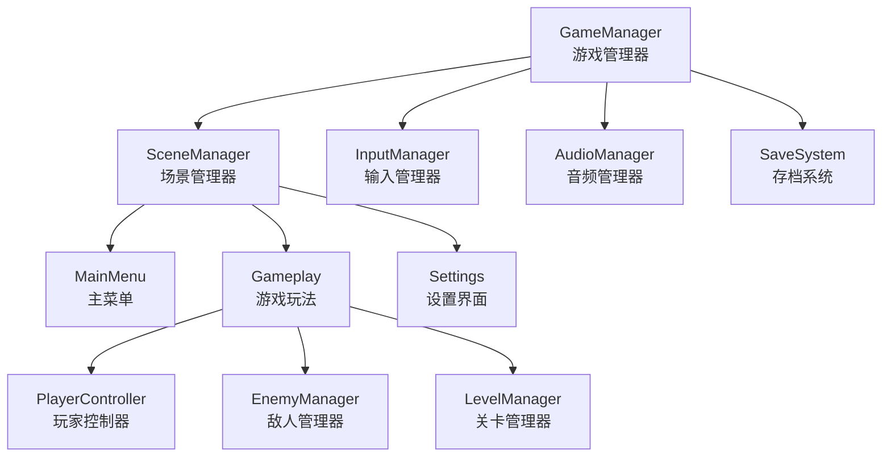
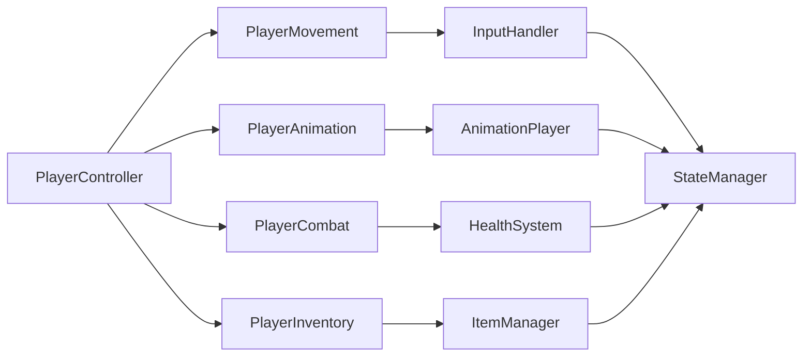
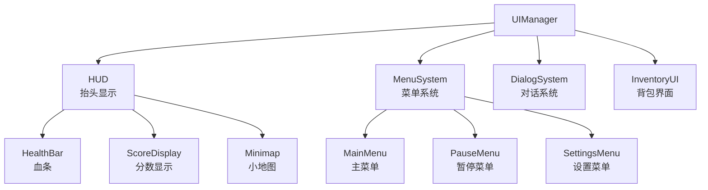
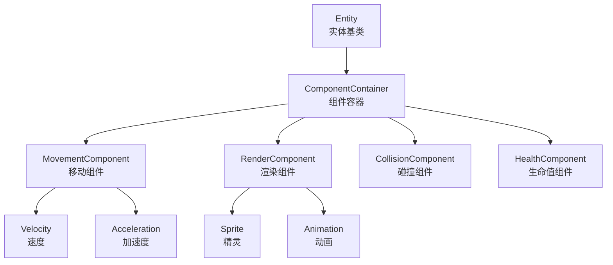
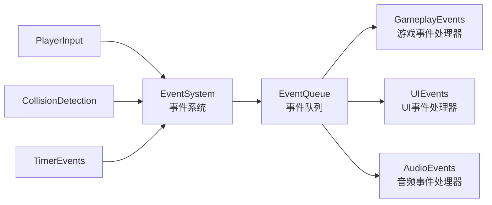
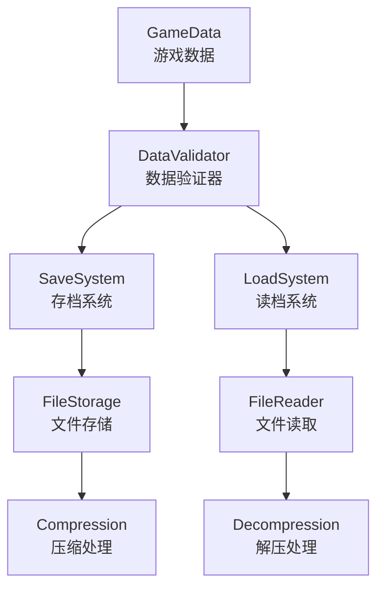

# Godot 2D游戏架构设计模板

## 模块化设计框架

### 1. 游戏核心系统


### 2. 玩家系统架构


### 3. UI系统架构


## 详细设计模板

### 模块设计表模板

| 模块名称 | 功能描述 | 核心类/脚本 | 依赖关系 | 关键接口 |
|---------|---------|------------|---------|---------|
| PlayerMovement | 玩家移动控制 | PlayerMovement.gd | InputManager | move(direction), jump(), dash() |
| EnemyAI | 敌人AI行为 | EnemyAI.gd | PlayerController | set_target(target), execute_ai() |
| LevelGeneration | 关卡生成 | LevelGenerator.gd | TileMap, RoomTemplates | generate_level(seed) |

### 场景设计表模板

| 场景名称 | 场景类型 | 包含节点 | 脚本文件 | 资源依赖 | 功能说明 |
|---------|---------|---------|---------|---------|---------|
| Player | 可重用场景 | CharacterBody2D, Sprite2D, Camera2D | PlayerController.gd, PlayerMovement.gd | player_sprites.tres | 玩家角色控制 |
| Enemy | 可重用场景 | CharacterBody2D, AnimatedSprite2D | EnemyAI.gd, EnemyHealth.gd | enemy_animations.tres | 敌人实体 |
| Level | 独立场景 | Node2D, TileMap, Player | LevelManager.gd | level_tiles.tres | 游戏关卡 |

### 数据结构模板

#### 游戏状态数据
```gdscript
# GameState.gd
extends Resource

@export var current_level: int = 1
@export var player_position: Vector2 = Vector2.ZERO
@export var player_health: int = 100
@export var inventory_items: Array[ItemData] = []
@export var unlocked_abilities: Array[String] = []
@export var game_time: float = 0.0
```

#### 关卡配置数据
```gdscript
# LevelData.gd
extends Resource

@export var level_name: String
@export var tilemap_path: String
@export var enemy_spawns: Array[EnemySpawnData]
@export var item_locations: Array[ItemSpawnData]
@export var background_music: AudioStream
@export var required_score: int
```

### 信号接口定义

#### 玩家事件信号
```gdscript
signal player_moved(from: Vector2, to: Vector2)
signal player_jumped()
signal player_attacked(attack_type: String)
signal player_damaged(damage: int)
signal player_healed(heal_amount: int)
signal player_died()
signal level_completed(level_number: int)
```

#### 游戏状态信号
```gdscript
signal game_started()
signal game_paused()
signal game_resumed()
signal game_over(final_score: int)
signal settings_changed(setting_name: String, value: Variant)
```

### 接口定义模板

#### 组件接口
```gdscript
# IComponent.gd
extends Resource

# 组件基础接口
func initialize(parent_node: Node):
    pass

func process(delta: float):
    pass

func cleanup():
    pass
```

#### 状态接口
```gdscript
# IState.gd
extends Resource

func enter():
    pass

func exit():
    pass

func update(delta: float):
    pass

func handle_input(event: InputEvent):
    pass
```

## 设计模式应用

### 1. 组件系统设计


### 2. 事件驱动架构


### 3. 数据流架构


## 性能设计考虑

### 1. 对象管理策略
- **对象池**: 频繁创建销毁的对象使用对象池
- **LOD系统**: 根据距离调整对象细节
- **视锥剔除**: 只处理可见区域内的对象

### 2. 内存管理策略
- **资源预加载**: 提前加载必要资源
- **延迟加载**: 按需加载非关键资源
- **资源释放**: 及时释放不需要的资源

### 3. 渲染优化策略
- **批处理**: 合并相似渲染操作
- **纹理图集**: 减少纹理切换次数
- **阴影优化**: 合理使用阴影技术

## 扩展性设计

### 1. 插件系统
```gdscript
# PluginManager.gd
extends Node

var plugins = {}

func register_plugin(plugin_name: String, plugin: Plugin):
    plugins[plugin_name] = plugin

func get_plugin(plugin_name: String) -> Plugin:
    return plugins.get(plugin_name)
```

### 2. 模块加载系统
```gdscript
# ModuleLoader.gd
extends Node

func load_module(module_path: String):
    var module_script = load(module_path)
    var module = module_script.new()
    add_child(module)
    return module
```

### 3. 配置系统
```gdscript
# ConfigManager.gd
extends Node

var config_data = {}

func load_config(file_path: String):
    var file = FileAccess.open(file_path, FileAccess.READ)
    if file:
        var json_string = file.get_as_text()
        var json = JSON.new()
        json.parse(json_string)
        config_data = json.data
```

## 测试设计策略

### 1. 单元测试框架
```gdscript
# TestCase.gd
extends RefCounted

func setup():
    pass

func teardown():
    pass

func assert_equal(expected, actual, message = ""):
    if expected != actual:
        push_error("Assertion failed: " + message)

func test_function():
    # 具体测试逻辑
    pass
```

### 2. 集成测试
- **场景加载测试**: 验证场景正确加载
- **组件交互测试**: 验证组件间正确交互
- **数据流测试**: 验证数据正确流转

### 3. 性能测试
- **帧率监控**: 监控游戏运行帧率
- **内存使用**: 监控内存使用情况
- **加载时间**: 测试资源加载时间