# Godot 2D游戏详细设计工作流

## 设计流程概览

### 阶段1: 需求分析与架构规划
1. **理解游戏概念和核心玩法**
   - 分析游戏类型（平台跳跃、RPG、射击等）
   - 确定核心机制和交互方式
   - 明确目标平台和技术限制

2. **模块分解**
   - 识别主要功能模块
   - 确定模块间依赖关系
   - 定义模块接口规范

### 阶段2: 详细架构设计
1. **场景结构设计**
   - 设计场景层次结构
   - 确定可重用场景
   - 定义场景加载策略

2. **组件系统设计**
   - 设计组件接口
   - 确定组件组合方式
   - 定义组件通信机制

### 阶段3: 实现规划
1. **开发优先级排序**
   - 核心功能优先
   - 依赖关系考虑
   - 风险评估

2. **技术选型**
   - 选择合适的Godot功能
   - 确定第三方资源需求
   - 制定性能优化策略

## 模块设计工作流

### 1. 玩家系统设计流程

#### 步骤1: 核心行为分析
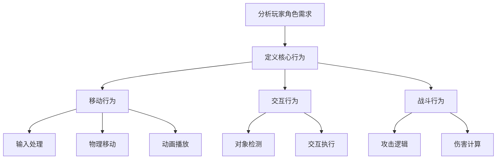

#### 步骤2: 组件设计
| 组件名称 | 职责 | 接口定义 | 依赖组件 |
|---------|------|---------|---------|
| InputComponent | 处理玩家输入 | `handle_input(event: InputEvent)` | 无 |
| MovementComponent | 处理物理移动 | `move(direction: Vector2)` | InputComponent |
| AnimationComponent | 控制角色动画 | `play_animation(name: String)` | MovementComponent |
| HealthComponent | 管理生命值 | `take_damage(amount: int)` | 无 |

#### 步骤3: 状态机设计
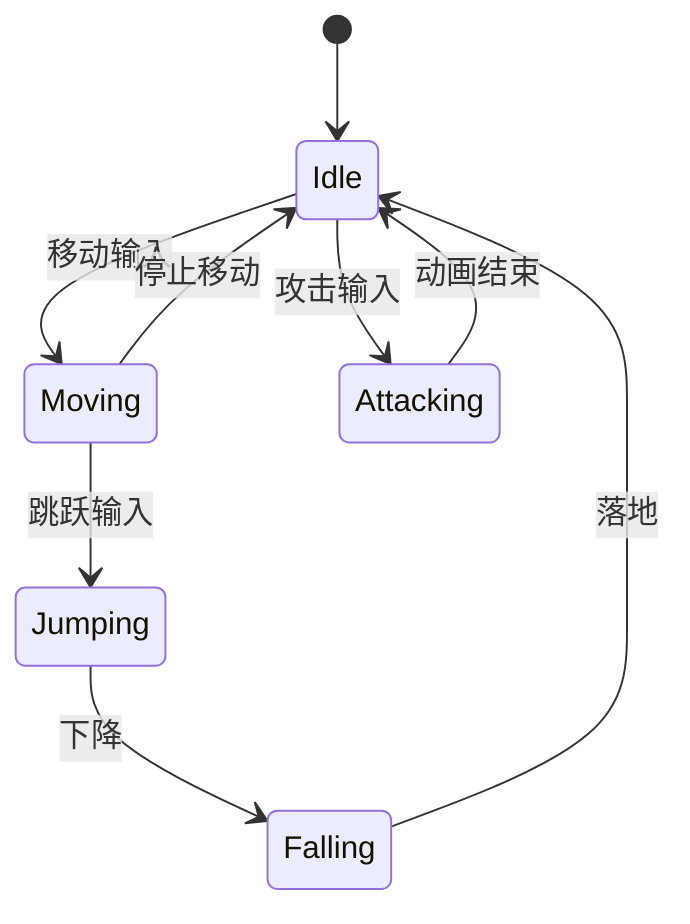

### 2. 敌人AI系统设计流程

#### 步骤1: AI行为类型分析
- **巡逻型敌人**: 路径巡逻，发现玩家后追逐
- **守护型敌人**: 固定区域守护，玩家进入范围后攻击
- **智能型敌人**: 复杂的行为树，多策略选择

#### 步骤2: AI架构设计
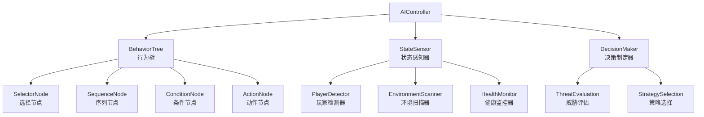

#### 步骤3: 行为树设计
```
Selector (选择器)
├── Sequence (序列器 - 攻击玩家)
│   ├── Condition (条件 - 玩家在攻击范围)
│   ├── Action (动作 - 面向玩家)
│   └── Action (动作 - 执行攻击)
├── Sequence (序列器 - 追逐玩家)
│   ├── Condition (条件 - 玩家在视野范围)
│   ├── Action (动作 - 计算路径)
│   └── Action (动作 - 移动到玩家)
└── Sequence (序列器 - 巡逻)
    ├── Action (动作 - 选择巡逻点)
    └── Action (动作 - 移动到巡逻点)
```

### 3. 关卡系统设计流程

#### 步骤1: 关卡结构分析
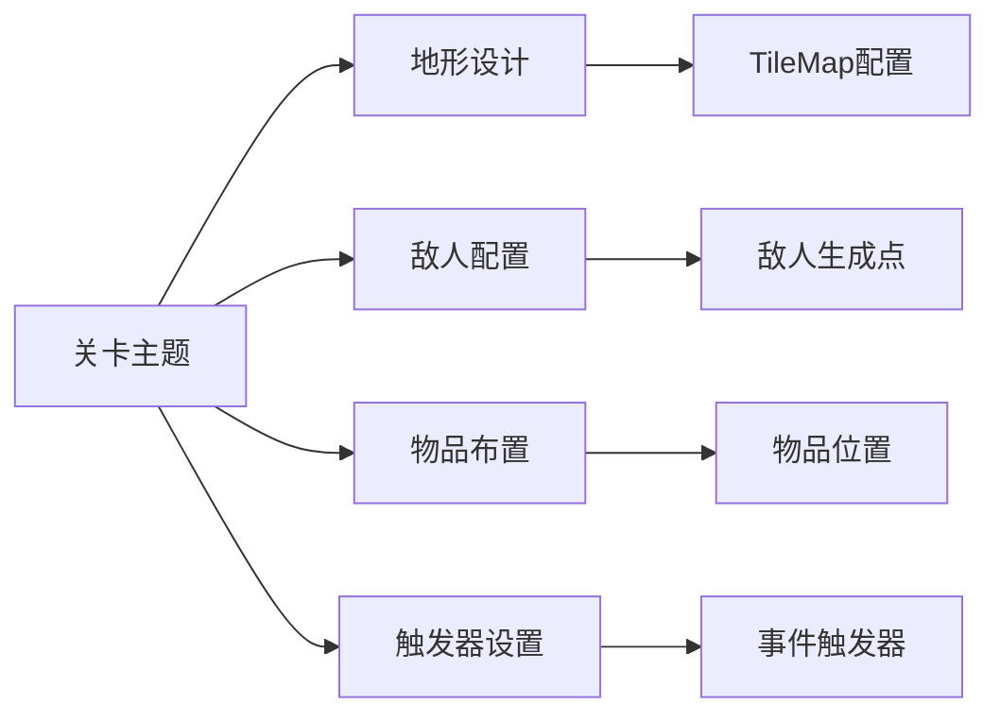

#### 步骤2: 关卡数据结构
```gdscript
# LevelData.gd
@tool
extends Resource

class_name LevelData

@export var level_name: String = ""
@export var level_size: Vector2i = Vector2i(100, 100)
@export var tilemap_layers: Array[TileMapLayerData]
@export var enemy_spawns: Array[EnemySpawnData]
@export var item_pickups: Array[ItemPickupData]
@export var trigger_zones: Array[TriggerZoneData]
@export var background_music: AudioStream
@export var ambient_sounds: Array[AudioStream]

# 子数据结构
class TileMapLayerData:
    @export var layer_name: String
    @export var tile_set: TileSet
    @export var tile_data: PackedInt32Array

class EnemySpawnData:
    @export var enemy_type: String
    @export var spawn_position: Vector2
    @export var spawn_delay: float = 0.0
    @export var patrol_path: Array[Vector2]

class ItemPickupData:
    @export var item_type: String
    @export var position: Vector2
    @export var quantity: int = 1
    @export var respawn_time: float = -1.0  # -1表示不重生

class TriggerZoneData:
    @export var zone_type: String
    @export var area: Rect2
    @export var trigger_once: bool = true
    @export var target_events: Array[String]
    @export var parameters: Dictionary = {}
```

#### 步骤3: 关卡生成工作流
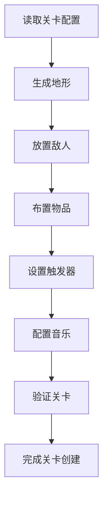

## UI系统设计工作流

### 1. UI层次结构设计
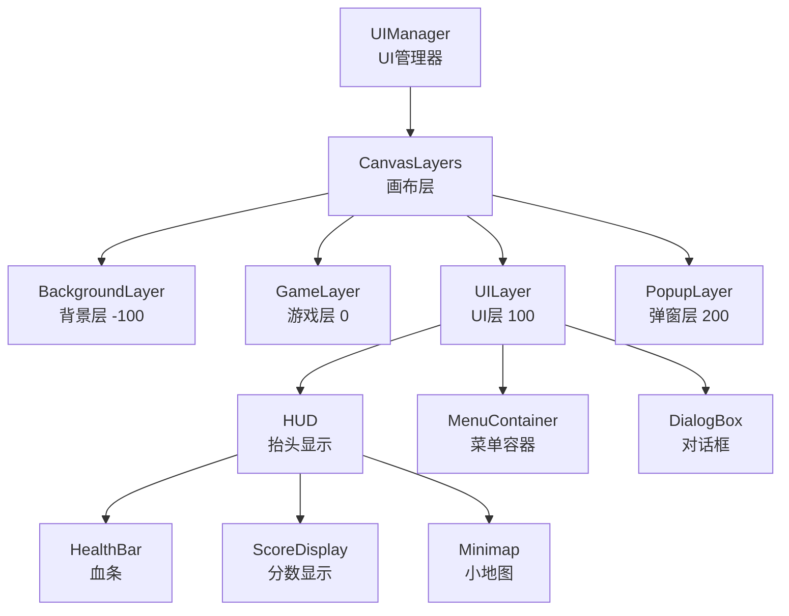

### 2. 响应式UI设计
```gdscript
# ResponsiveUI.gd
extends Control

func _ready():
    # 监听屏幕尺寸变化
    get_viewport().size_changed.connect(_on_viewport_resized)
    _on_viewport_resized()

func _on_viewport_resized():
    var screen_size = get_viewport().get_visible_rect().size
    _update_layout(screen_size)

func _update_layout(screen_size: Vector2):
    # 根据屏幕尺寸调整UI布局
    if screen_size.x < 1024:  # 移动设备
        _apply_mobile_layout()
    elif screen_size.x < 1920:  # 平板设备
        _apply_tablet_layout()
    else:  # 桌面设备
        _apply_desktop_layout()
```

### 3. UI动画系统
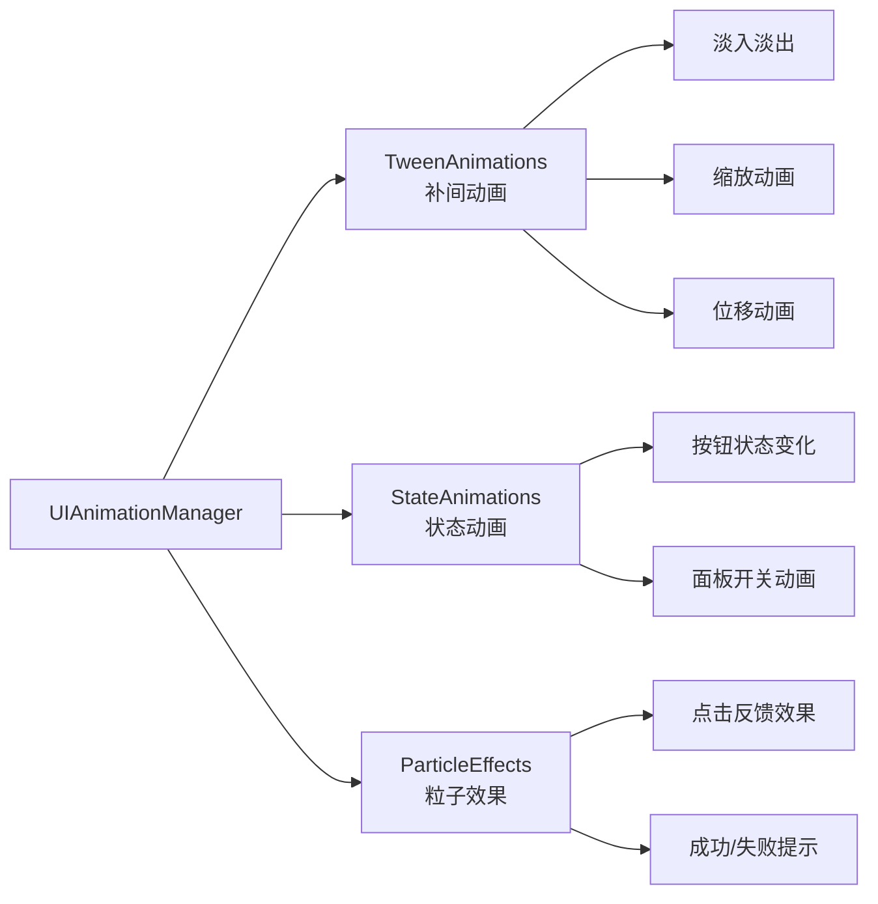

## 数据管理系统设计工作流

### 1. 游戏状态管理
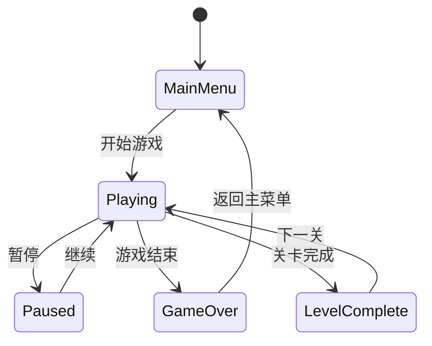

### 2. 存档系统设计
```gdscript
# SaveSystem.gd
extends Node

signal save_completed(success: bool)
signal load_completed(game_data: Dictionary)

func save_game():
    var game_data = _collect_game_data()
    _save_to_file(game_data)

func load_game():
    var game_data = _load_from_file()
    if game_data:
        _apply_game_data(game_data)

func _collect_game_data() -> Dictionary:
    return {
        "player_data": _get_player_data(),
        "level_data": _get_level_data(),
        "inventory_data": _get_inventory_data(),
        "settings_data": _get_settings_data(),
        "timestamp": Time.get_unix_time_from_system()
    }
```

### 3. 配置系统设计
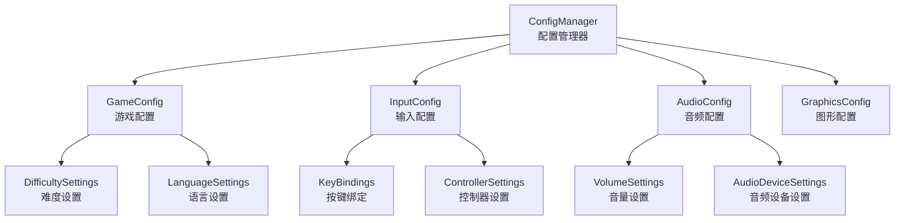

## 性能优化设计工作流

### 1. 渲染优化策略
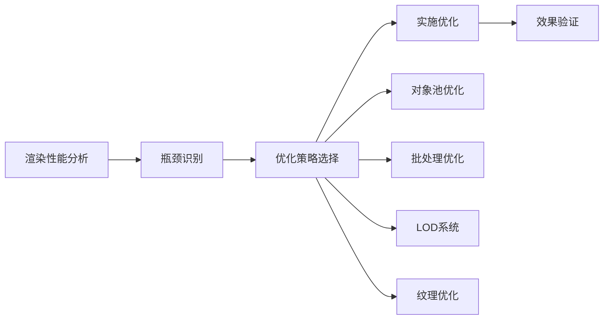

### 2. 内存管理策略
```gdscript
# MemoryManager.gd
extends Node

var resource_cache = {}
var object_pools = {}

func preload_resources(resource_list: Array[String]):
    for resource_path in resource_list:
        if not resource_cache.has(resource_path):
            resource_cache[resource_path] = load(resource_path)

func get_object_from_pool(pool_name: String):
    if not object_pools.has(pool_name):
        object_pools[pool_name] = []

    var pool = object_pools[pool_name]
    if pool.size() > 0:
        return pool.pop_back()
    else:
        return _create_new_object(pool_name)

func return_object_to_pool(pool_name: String, object: Node):
    if not object_pools.has(pool_name):
        object_pools[pool_name] = []

    object.get_parent().remove_child(object)
    object_pools[pool_name].push_back(object)
```

## 测试驱动设计工作流

### 1. 测试金字塔
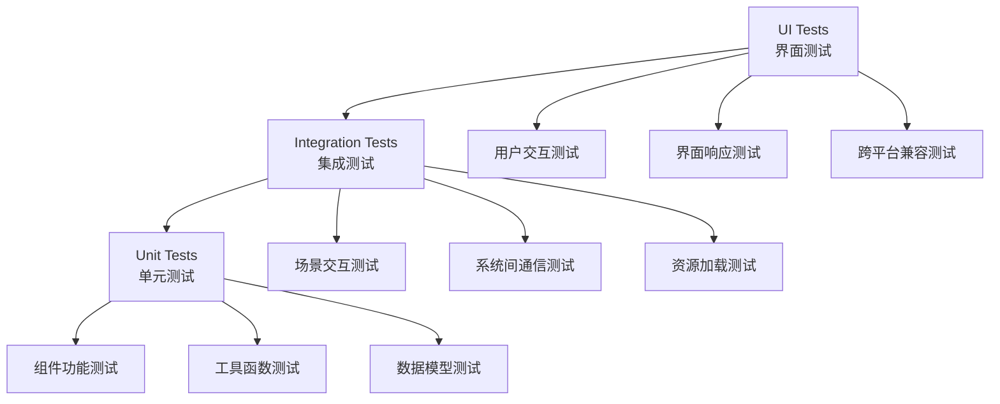

### 2. 测试驱动开发流程
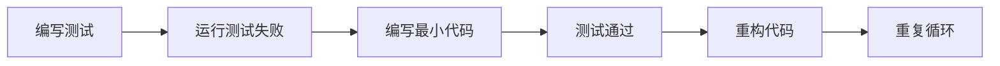

### 3. 自动化测试框架
```gdscript
# TestRunner.gd
extends Node

var test_cases = []

func add_test_case(test_case: TestCase):
    test_cases.append(test_case)

func run_all_tests():
    var passed_tests = 0
    var failed_tests = 0

    for test_case in test_cases:
        test_case.setup()
        var result = test_case.run()
        test_case.teardown()

        if result.passed:
            passed_tests += 1
        else:
            failed_tests += 1
            push_error("Test failed: " + result.message)

    print("Tests completed. Passed: %d, Failed: %d" % [passed_tests, failed_tests])
```