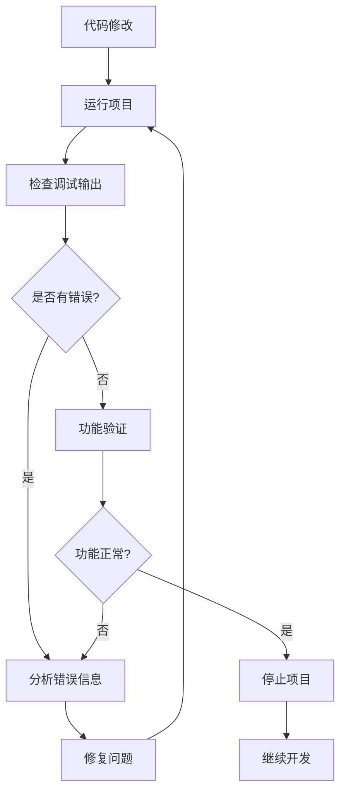

# Godot调试和问题解决指南

## 目录
1. [MCP工具调试工作流程](#mcp工具调试工作流程)
2. [常见错误类型和解决方案](#常见错误类型和解决方案)
3. [实时调试技巧](#实时调试技巧)
4. [性能分析和优化](#性能分析和优化)
5. [场景调试方法](#场景调试方法)

## MCP工具调试工作流程

### 1. 标准调试循环


### 2. 工具使用顺序
**调试阶段必需步骤：**
1. **项目启动**：`mcp__godot__run_project`
2. **输出监控**：`mcp__godot__get_debug_output`
3. **问题分析**：分析错误信息和警告
4. **代码修复**：修改问题代码
5. **重新测试**：重新运行验证修复效果
6. **项目停止**：`mcp__godot__stop_project`

### 3. 调试命令模板
```bash
# 运行项目
mcp__godot__run_project --projectPath="项目路径"

# 获取调试输出（重复执行以获取最新输出）
mcp__godot__get_debug_output

# 停止项目
mcp__godot__stop_project
```

## 常见错误类型和解决方案

### 1. 语法错误
**错误特征：**
- 语法解析错误
- 缺少分号、括号不匹配
- 变量未定义或类型错误

**调试步骤：**
1. 运行项目检查语法错误
2. 分析调试输出的错误位置
3. 修复语法问题
4. 重新运行验证修复

**示例调试流程：**
```bash
# 1. 运行项目检查语法
mcp__godot__run_project --projectPath="./my_game"

# 2. 获取错误输出
mcp__godot__get_debug_output
# 输出：Parser Error: syntax error, unexpected ')'

# 3. 修复代码后重新运行
mcp__godot__run_project --projectPath="./my_game"
```

### 2. 运行时错误
**错误特征：**
- 空指针引用
- 数组越界
- 节点未找到
- 类型转换失败

**调试策略：**
1. 使用调试输出定位错误行
2. 添加临时调试打印语句
3. 检查变量和对象状态
4. 验证节点路径和引用

**常见运行时错误处理：**
```gdscript
# 添加错误检查
func get_player_node():
    var player = get_node_or_null("Player")
    if player == null:
        print("DEBUG: Player node not found at path: Player")
        push_error("Player node is missing!")
        return null
    return player

# 安全访问节点
func safe_call_player_method():
    var player = get_player_node()
    if player and player.has_method("take_damage"):
        player.take_damage(10)
    else:
        print("DEBUG: Cannot call take_damage on player")
```

### 3. 逻辑错误
**错误特征：**
- 算法计算错误
- 条件判断错误
- 状态机转换错误
- 数据处理错误

**调试技巧：**
1. 添加详细的状态日志
2. 验证关键变量值
3. 单步测试复杂逻辑
4. 使用断点调试（在编辑器中）

**逻辑错误调试模板：**
```gdscript
func calculate_damage(base_damage: int, multiplier: float) -> int:
    print("DEBUG: calculate_damage called with base_damage=", base_damage, ", multiplier=", multiplier)
    
    var result = int(base_damage * multiplier)
    print("DEBUG: intermediate result=", result)
    
    # 验证计算逻辑
    if result < 0:
        print("DEBUG: Warning - negative damage calculated!")
        result = 0
    
    print("DEBUG: final damage result=", result)
    return result
```

### 4. 性能问题
**问题特征：**
- 帧率下降
- 内存泄漏
- CPU使用率过高
- 加载时间过长

**性能调试方法：**
1. 使用Godot性能分析器
2. 监控帧率和内存使用
3. 分析热循环和重计算
4. 优化渲染和物理计算

## 实时调试技巧

### 1. 调试输出策略
**分层调试信息：**
```gdscript
# 调试级别控制
var debug_level = 1  # 0=无输出, 1=基础, 2=详细, 3=全部

func debug_log(message: String, level: int = 1):
    if debug_level >= level:
        print("[%s] %s" % [Time.get_datetime_string_from_system(), message])

# 使用示例
func player_move():
    debug_log("Player movement started", 1)
    debug_log("Input vector: " + str(input_vector), 2)
    debug_log("Animation state: " + str(animation_state), 3)
```

### 2. 实时状态监控
**节点状态显示：**
```gdscript
# 在场景中添加调试信息显示
func _draw():
    if debug_mode:
        # 绘制调试信息
        draw_string(font, Vector2(10, 20), "Position: " + str(global_position))
        draw_string(font, Vector2(10, 40), "Velocity: " + str(velocity))
        draw_string(font, Vector2(10, 60), "Health: " + str(health))

# 实时数据更新
func _process(delta):
    if debug_mode:
        update_debug_info()
```

### 3. 热重载调试
**使用MCP工具快速测试：**
1. 修改脚本代码
2. 保存文件
3. 运行项目验证
4. 检查调试输出
5. 停止项目继续修改

## 性能分析和优化

### 1. 使用MCP工具进行性能测试
```bash
# 运行项目并监控性能
mcp__godot__run_project --projectPath="项目路径"

# 定期检查调试输出中的性能信息
mcp__godot__get_debug_output
```

### 2. 常见性能瓶颈检测
**帧率问题识别：**
```gdscript
# 性能监控代码
var frame_count = 0
var fps_update_timer = 0.0

func _process(delta):
    frame_count += 1
    fps_update_timer += delta
    
    if fps_update_timer >= 1.0:
        var fps = frame_count / fps_update_timer
        print("DEBUG: FPS = ", fps)
        
        if fps < 30:
            print("WARNING: Low FPS detected!")
        
        frame_count = 0
        fps_update_timer = 0.0
```

### 3. 内存使用监控
```gdscript
# 内存监控
func check_memory_usage():
    var static_mem = OS.get_static_memory_usage_by_type()
    print("DEBUG: Static memory usage: ", static_mem)
    
    if static_mem > 100 * 1024 * 1024:  # 100MB
        print("WARNING: High memory usage detected!")
```

## 场景调试方法

### 1. 使用MCP场景工具
**调试场景创建：**
```bash
# 创建调试场景
mcp__godot__create_scene --projectPath="项目路径" --scenePath="debug_scene.tscn" --rootNodeType="Node2D"

# 添加调试节点
mcp__godot__add_node --projectPath="项目路径" --scenePath="debug_scene.tscn" --nodeType="Label" --nodeName="DebugLabel" --parentNodePath="root"

# 保存调试场景
mcp__godot__save_scene --projectPath="项目路径" --scenePath="debug_scene.tscn"
```

### 2. 可视化调试
**调试可视化元素：**
```gdscript
# 绘制调试形状
func draw_debug_shapes():
    # 绘制碰撞边界
    var collision_shape = $CollisionShape2D.shape
    draw_rect(collision_shape.get_rect(), Color.RED, false, 2.0)
    
    # 绘制移动路径
    for i in range(path.size() - 1):
        draw_line(path[i], path[i + 1], Color.GREEN, 2.0)

# 调试信息节点
func create_debug_info():
    var debug_label = Label.new()
    debug_label.name = "DebugInfo"
    debug_label.text = "Debug Mode Active"
    add_child(debug_label)
```

### 3. 节点状态检查
**节点引用验证：**
```gdscript
func validate_scene_structure():
    var required_nodes = ["Player", "Camera", "UI"]
    var missing_nodes = []
    
    for node_name in required_nodes:
        if not has_node(node_name):
            missing_nodes.append(node_name)
    
    if missing_nodes.size() > 0:
        print("DEBUG: Missing nodes: ", missing_nodes)
        return false
    
    print("DEBUG: Scene structure validation passed")
    return true
```

## 调试最佳实践

### 1. 调试代码管理
```gdscript
# 使用编译条件控制调试代码
const DEBUG_MODE = true

func debug_function():
    if DEBUG_MODE:
        # 调试代码
        print("Debug information")
        draw_debug_info()

# 发布时自动移除调试代码
func release_build():
    if not OS.is_debug_build():
        # 清理调试资源
        remove_debug_nodes()
```

### 2. 错误记录和分析
```gdscript
# 错误记录系统
var error_log = []

func log_error(error_message: String, context: Dictionary = {}):
    var error_entry = {
        "timestamp": Time.get_datetime_string_from_system(),
        "message": error_message,
        "context": context
    }
    error_log.append(error_entry)
    print("ERROR: ", error_message)

func get_error_summary():
    var summary = "Error Summary:\n"
    for error in error_log:
        summary += "- [%s] %s\n" % [error.timestamp, error.message]
    return summary
```

### 3. 调试工作流程检查清单
**每次调试会话检查：**
- [ ] 项目运行正常
- [ ] 调试输出正确读取
- [ ] 错误信息完整分析
- [ ] 问题修复验证通过
- [ ] 性能影响评估完成
- [ ] 调试资源清理干净
- [ ] 代码质量保持标准

## 故障排除快速参考

### 常见调试问题解决方案
1. **项目无法运行**：检查项目路径和配置
2. **调试输出为空**：确认项目正在运行
3. **场景编辑失败**：检查场景路径和节点类型
4. **性能分析无数据**：确保在运行状态下监控
5. **内存泄漏**：定期检查资源释放情况