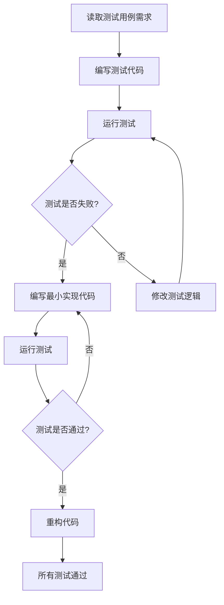

# Godot TDD开发指南

## 目录
1. [TDD在Godot中的实现](#tdd在godot中的实现)
2. [测试框架选择](#测试框架选择)
3. [测试用例设计](#测试用例设计)
4. [Red-Green-Refactor循环](#red-green-refactor循环)
5. [测试组织结构](#测试组织结构)
6. [常见测试模式](#常见测试模式)

## TDD在Godot中的实现

### TDD核心原则
1. **先写测试**：在实现功能代码之前编写测试
2. **失败优先**：确保测试在实现前失败（Red阶段）
3. **最小实现**：编写刚好足够通过测试的代码（Green阶段）
4. **持续重构**：在保持测试通过的前提下优化代码（Refactor阶段）

### Godot TDD工作流程


## 测试框架选择

### 1. Godot内置测试系统
**适用场景**：简单测试、基本功能验证

**优点**：
- 无需外部依赖
- 与Godot编辑器集成
- 适合单元测试和集成测试

**基本用法**：
```gdscript
# test_player.gd
extends "res://addons/gut/test.gd"

var player: Player

func before_each():
    player = preload("res://scenes/Player.tscn").instantiate()
    add_child(player)

func test_player_initial_health():
    assert_eq(player.health, 100, "Player should start with 100 health")

func test_player_take_damage():
    player.take_damage(20)
    assert_eq(player.health, 80, "Player health should be 80 after taking 20 damage")
```

### 2. GUT (Godot Unit Test)
**适用场景**：复杂项目、高级测试功能

**安装**：
```
在AssetLib中搜索"GUT"并安装
或从GitHub下载最新版本
```

**配置**：
```gdscript
# 项目设置 > 自动加载 > Gut
var Gut = preload("res://addons/gut/gut.gd").new()
```

**高级功能**：
- 参数化测试
- Mock和Stub支持
- 测试覆盖率
- 性能测试

### 3. 自定义测试框架
**适用场景**：特殊需求、轻量级测试

## 测试用例设计

### 1. 测试用例提取原则
从测试用例文档中提取：
- **输入条件**：测试的前置条件
- **操作步骤**：具体的测试动作
- **预期结果**：期望的输出结果
- **边界条件**：极限值和异常情况

### 2. 测试分类

#### 单元测试
**范围**：单个函数或方法的测试
**重点**：逻辑正确性、边界条件

```gdscript
func test_calculate_damage_normal():
    var damage = calculate_damage(10, 2.0)
    assert_eq(damage, 20, "Normal damage calculation")

func test_calculate_damage_critical():
    var damage = calculate_damage(10, 2.0, true)
    assert_eq(damage, 40, "Critical hit should double damage")
```

#### 集成测试
**范围**：多个组件协同工作的测试
**重点**：组件间交互、数据流

```gdscript
func test_player_enemy_combat():
    var player = create_player()
    var enemy = create_enemy()
    
    player.attack(enemy)
    assert_true(enemy.health < enemy.max_health, "Enemy should take damage")
```

#### 系统测试
**范围**：完整功能系统的测试
**重点**：端到端功能验证

### 3. 测试用例模板
```gdscript
# [功能名称]测试
extends "res://addons/gut/test.gd"

# 测试对象
var test_object: [ClassName]

# 测试前置条件
func before_each():
    # 初始化测试环境
    test_object = preload("res://[场景路径]").instantiate()
    add_child(test_object)

# 测试后置清理
func after_each():
    # 清理测试环境
    if test_object:
        test_object.queue_free()

# 测试用例1：正常功能
func test_[功能名称]_[正常场景]():
    # Arrange - 准备测试数据
    var input_data = [测试数据]
    
    # Act - 执行测试动作
    var result = test_object.[被测试方法](input_data)
    
    # Assert - 验证结果
    assert_eq(result, [期望结果], "[测试描述]")

# 测试用例2：边界条件
func test_[功能名称]_[边界场景]():
    # 测试边界条件
    pass

# 测试用例3：异常处理
func test_[功能名称]_[异常场景]():
    # 测试异常情况
    pass
```

## Red-Green-Refactor循环

### 1. Red阶段（编写失败的测试）
```gdscript
# 先写测试，预期失败
func test_player_jump():
    player.jump()
    assert_true(player.is_jumping, "Player should be jumping after jump()")
    # 此时Player类没有jump()方法，测试会失败
```

### 2. Green阶段（最小实现）
```gdscript
# Player.gd - 最小实现使测试通过
extends CharacterBody2D

var is_jumping: bool = false

func jump():
    is_jumping = true
```

### 3. Refactor阶段（优化代码）
```gdscript
# Player.gd - 重构优化
extends CharacterBody2D

@export var jump_force: float = 300.0
var is_jumping: bool = false

func jump():
    if is_on_floor():
        velocity.y = -jump_force
        is_jumping = true

func _physics_process(delta):
    super._physics_process(delta)
    if is_on_floor() and is_jumping:
        is_jumping = false
```

## 测试组织结构

### 1. 目录结构
```
tests/
├── unit/
│   ├── test_player.gd
│   ├── test_enemy.gd
│   └── test_inventory.gd
├── integration/
│   ├── test_combat_system.gd
│   └── test_player_ui.gd
├── system/
│   ├── test_game_flow.gd
│   └── test_save_load.gd
└── test_suite.gd
```

### 2. 测试套件
```gdscript
# test_suite.gd
extends "res://addons/gut/test.gd"

func run_tests():
    # 单元测试
    add_script("res://tests/unit/test_player.gd")
    add_script("res://tests/unit/test_enemy.gd")
    
    # 集成测试
    add_script("res://tests/integration/test_combat_system.gd")
    
    # 系统测试
    add_script("res://tests/system/test_game_flow.gd")
```

### 3. 测试配置
```gdscript
# 项目设置 > 自动加载
var TestRunner = preload("res://tests/test_runner.gd").new()

# test_runner.gd
extends Node

func run_all_tests():
    var gut = $Gut
    gut.get_script().add_script("res://tests/unit/")
    gut.get_script().add_script("res://tests/integration/")
    gut.get_script().test()
```

## 常见测试模式

### 1. 数据驱动测试
```gdscript
# 使用参数化测试多种输入
func test_damage_calculation():
    var test_cases = [
        {input: [10, 1.0], expected: 10},
        {input: [10, 2.0], expected: 20},
        {input: [10, 0.5], expected: 5},
    ]
    
    for case in test_cases:
        var result = calculate_damage(case.input[0], case.input[1])
        assert_eq(result, case.expected, 
            "Damage calculation failed for input: %s" % case.input)
```

### 2. Mock和Stub
```gdscript
# 使用Mock对象隔离依赖
func test_player_attack_with_mock_enemy():
    var mock_enemy = double(Enemy).new()
    stub(mock_enemy, 'take_damage').to_call()
    
    player.attack(mock_enemy)
    
    assert_called(mock_enemy, 'take_damage')
```

### 3. 异步测试
```gdscript
func test_async_operation():
    await wait_for_signal(player.animation_finished, 2.0)
    assert_true(player.animation_ended, "Animation should finish")
```

### 4. 性能测试
```gdscript
func test_performance():
    var start_time = Time.get_ticks_msec()
    
    # 执行性能敏感操作
    for i in range(1000):
        player.update_position()
    
    var end_time = Time.get_ticks_msec()
    var duration = end_time - start_time
    
    assert_lt(duration, 100, "Performance test should complete within 100ms")
```

## 测试最佳实践

### 1. 测试命名
- **描述性名称**：`test_function_scenario_expected_result`
- **清晰意图**：`test_player_jump_when_on_ground_should_jump_successfully`
- **一致性**：使用统一的命名约定

### 2. 测试结构（AAA模式）
```gdscript
func test_example():
    # Arrange - 准备测试环境和数据
    var player = create_test_player()
    player.health = 100
    
    # Act - 执行测试动作
    player.take_damage(20)
    
    # Assert - 验证结果
    assert_eq(player.health, 80, "Player health should be 80")
```

### 3. 测试隔离
- **独立测试**：每个测试不依赖其他测试
- **清理资源**：使用after_each()清理测试资源
- **避免共享状态**：不使用全局变量存储测试状态

### 4. 测试覆盖率
- **行覆盖率**：确保关键代码行被测试
- **分支覆盖率**：测试所有条件分支
- **边界覆盖**：测试边界值和极限情况

## 错误处理和调试

### 1. 常见测试错误
- **测试环境不正确**：检查before_each设置
- **异步问题**：使用await处理异步操作
- **Mock配置错误**：验证Mock对象设置

### 2. 测试调试技巧
- **断言消息**：提供清晰的错误描述
- **日志输出**：使用print输出调试信息
- **分步调试**：在测试代码中设置断点

### 3. 测试维护
- **定期运行**：建立持续集成流程
- **及时更新**：代码变更时同步更新测试
- **重构测试**：保持测试代码质量