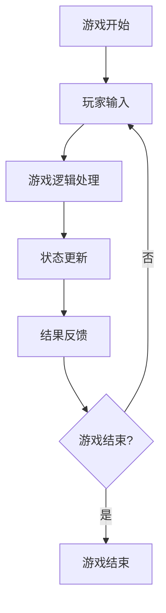
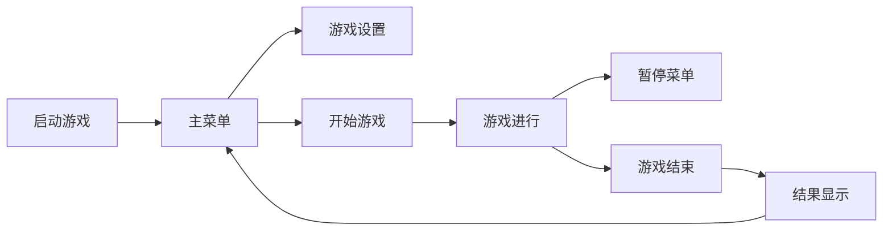

# 游戏设计文档模板

## 项目信息

**项目名称**: [项目名称]
**逆向分析日期**: [日期]
**分析版本**: [版本]
**项目路径**: [路径]

---

# 逆向生成游戏设计文档：[项目名称]

## 1. 游戏概述

### 1.1 游戏概念推导

基于代码结构和场景分析，推导出的游戏概念：

**核心概念**: [基于主要游戏机制推导]
**游戏类型**: [基于场景结构和脚本逻辑判断]
**目标平台**: [基于项目设置和资源配置判断]
**艺术风格**: [基于资源文件和UI设计分析]

**设计意图分析**:
- [分析代码体现的设计目标]
- [通过场景结构理解游戏定位]
- [基于技术选择推测设计理念]

### 1.2 核心玩法分析

**主要玩法机制**:
- [基于核心脚本和主要场景分析]
- [通过输入处理和控制逻辑推导]
- [从游戏循环和状态管理理解]

**玩家交互**:
- [输入方式分析]
- [控制响应机制]
- [反馈系统设计]

**游戏目标**:
- [基于胜负条件推导]
- [通过进度系统理解]
- [从成就系统分析]

### 1.3 目标受众定位

**目标用户群体**:
- [基于游戏复杂度判断]
- [通过内容深度分析]
- [从操作要求推测]

**用户体验设计**:
- [学习曲线分析]
- [难度递进设计]
- [用户界面友好性]

## 2. 核心机制设计

### 2.1 核心玩法循环

**游戏循环结构**:


**关键状态**:
- [基于状态机分析]
- [通过全局变量推导]
- [从场景切换理解]

**循环要素**:
- **输入处理**: [基于_input/_unhandled_input分析]
- **逻辑更新**: [基于_process/_physics_process分析]
- **状态管理**: [基于状态变量和逻辑]
- **反馈系统**: [基于UI更新和音效触发]

### 2.2 控制系统分析

**输入映射**:
- [基于Input Map配置分析]
- [通过按键绑定推导]
- [从输入处理函数理解]

**控制响应**:
- **即时响应**: [基于实时输入处理]
- **延迟响应**: [基于缓冲和队列系统]
- **组合操作**: [基于多按键组合逻辑]

**控制抽象**:
- [抽象层设计分析]
- [可配置性评估]
- [扩展性设计]

### 2.3 规则和机制推导

**游戏规则**:
- [基于条件判断和游戏逻辑推导]
- [通过约束和限制理解]
- [从惩罚和奖励机制分析]

**胜利条件**:
- [基于胜利状态检查分析]
- [通过条件组合理解]
- [从事件触发推导]

**失败条件**:
- [基于失败状态处理分析]
- [通过生命值/资源耗尽理解]
- [从错误处理推导]

## 3. 系统功能设计

### 3.1 进程系统

**进度追踪**:
- [基于进度变量和保存系统分析]
- [通过关卡/章节组织理解]
- [从成就系统推导]

**存档系统**:
- **数据结构**: [基于保存数据格式分析]
- **存储时机**: [基于自动/手动保存触发]
- **数据完整性**: [基于错误处理和备份机制]

**成就系统**:
- [基于成就条件和触发机制分析]
- [通过奖励系统集成理解]
- [从进度追踪推导]

### 3.2 战斗/挑战系统

**冲突机制**:
- [基于伤害计算和碰撞检测分析]
- [通过敌对行为逻辑理解]
- [从难度平衡推导]

**挑战设计**:
- **难度曲线**: [基于敌人生成和难度递进分析]
- **玩家成长**: [基于属性提升和能力解锁理解]
- **策略要素**: [基于选择和决策机制推导]

**奖励系统**:
- [基于奖励发放和积分系统分析]
- [通过道具获取理解]
- [从经济平衡推导]

### 3.3 经济/奖励系统

**资源管理**:
- [基于资源变量和操作函数分析]
- **资源类型**: [通过不同资源变量识别]
- **资源获取**: [基于生成和获取机制]
- **资源消耗**: [基于使用和扣减逻辑]

**平衡机制**:
- [基于经济平衡公式和参数分析]
- [通过通胀控制理解]
- [从长期平衡推导]

**交易系统**:
- [基于商店和交易逻辑分析]
- [通过价格体系理解]
- [从供需平衡推导]

## 4. 用户体验设计

### 4.1 UI/UX分析

**界面结构**:
- [基于场景层次和UI节点分析]
- **主界面**: [主要UI组件和布局]
- **游戏界面**: [实时信息显示]
- **菜单界面**: [设置和选项界面]

**交互设计**:
- [基于信号连接和事件处理分析]
- **导航逻辑**: [界面切换和流程]
- **反馈机制**: [视觉和听觉反馈]

**可访问性**:
- [基于配置选项和辅助功能分析]
- [通过调整参数理解设计考量]

### 4.2 交互流程推导

**用户旅程**:


**关键交互点**:
- [基于关键场景和状态转换分析]
- **决策点**: [玩家需要做出选择的时刻]
- **反馈点**: [系统响应玩家行为的时刻]
- **转换点**: [游戏状态发生变化时刻]

**用户体验优化**:
- [基于性能优化和加载策略分析]
- **加载时间**: [基于资源加载和场景切换]
- **响应速度**: [基于事件处理和更新频率]

## 5. 技术架构设计

### 5.1 系统架构推导

**整体架构**:
```
[表示层 - UI/场景]
    ↓
[逻辑层 - 游戏逻辑/业务规则]
    ↓
[数据层 - 数据存储/资源管理]
```

**模块划分**:
- [基于脚本组织和场景分组分析]
- **核心模块**: [主要游戏逻辑]
- **工具模块**: [通用功能和工具类]
- **数据模块**: [数据管理和存储]

**接口定义**:
- [基于信号连接和方法调用分析]
- **模块间通信**: [消息传递和数据共享]
- **事件系统**: [事件订阅和分发机制]

### 5.2 关键技术分析

**核心技术**:
- [基于项目设置和第三方库分析]
- **渲染技术**: [基于节点类型和渲染设置]
- **物理引擎**: [基于碰撞体和物理设置]
- **音频系统**: [基于音频节点和播放逻辑]

**算法设计**:
- **路径规划**: [基于移动和寻路算法]
- **AI逻辑**: [基于敌人行为和决策树]
- **程序生成**: [基于随机生成算法]
- **优化算法**: [基于性能优化技术]

**数据结构**:
- [基于数据组织和存储格式分析]
- **场景数据**: [场景文件结构]
- **游戏数据**: [运行时数据结构]
- **存档数据**: [保存文件格式]

### 5.3 性能优化策略

**渲染优化**:
- [基于批处理和遮挡剔除分析]
- **LOD系统**: [距离相关的细节层次]
- **材质合并**: [减少Draw Call策略]
- **视锥剔除**: [视野范围优化]

**内存优化**:
- [基于对象池和资源管理分析]
- **对象池**: [频繁创建销毁的对象管理]
- **资源卸载**: [不使用资源的释放策略]
- **垃圾回收**: [内存泄漏防护]

**计算优化**:
- [基于算法选择和数据处理分析]
- **空间分割**: [碰撞检测优化]
- **时间分片**: [大量计算的分批处理]
- **缓存策略**: [重复计算的结果缓存]

---

## 附录

### A. 代码分析数据

**文件统计**:
- 场景文件: [数量]
- 脚本文件: [数量]
- 资源文件: [数量]
- 总计代码行数: [数量]

**复杂度分析**:
- 圈复杂度: [平均复杂度]
- 依赖深度: [最大依赖深度]
- 模块耦合度: [耦合程度评估]

### B. 推导依据

**分析方法和工具**:
- [使用的主要分析方法]
- [依赖的工具和技术]
- [分析过程中的关键发现]

**不确定性说明**:
- [分析过程中遇到的限制]
- [无法确定的方面]
- [需要进一步验证的内容]

### C. 改进建议

**设计优化建议**:
- [基于代码分析的设计改进建议]
- [用户体验优化方向]
- [技术架构改进点]

**维护性建议**:
- [代码结构优化建议]
- [文档完善建议]
- [测试覆盖建议]