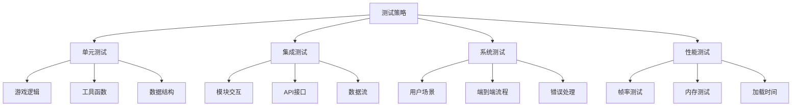
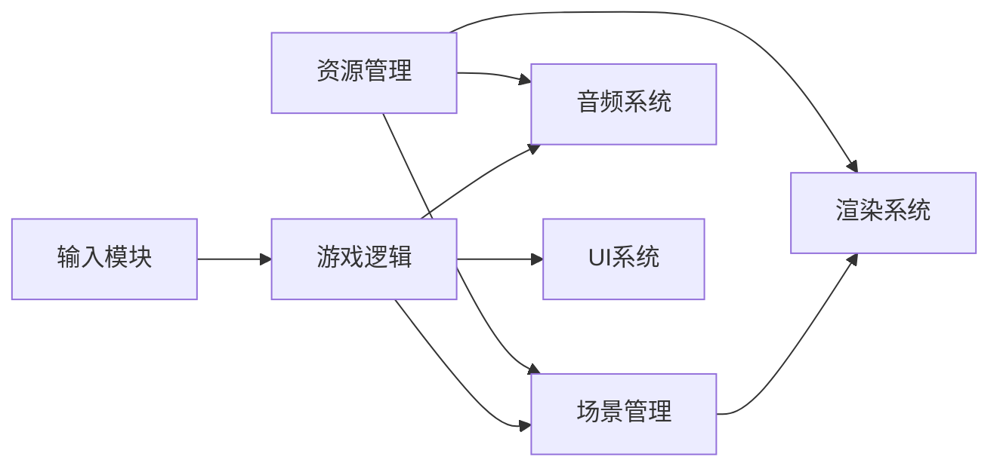
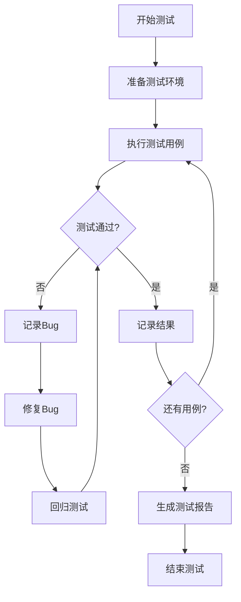
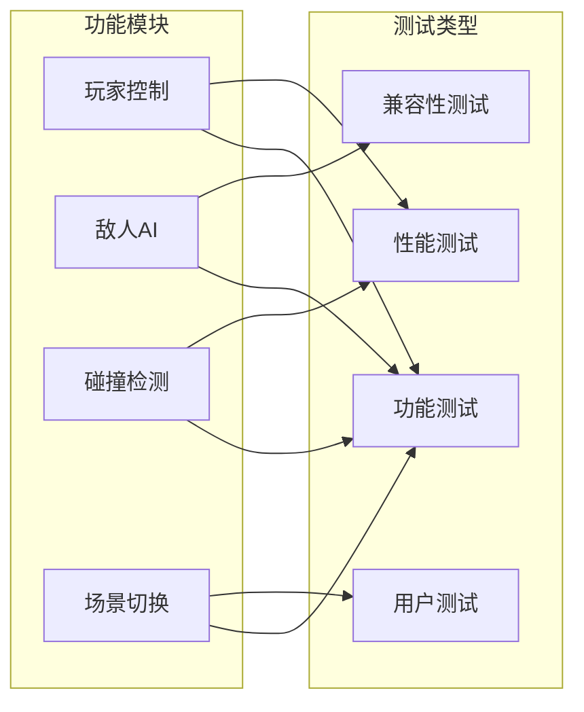

# Mermaid图表示例

## 测试架构图

```mermaid
graph TB
    A[测试策略] --> B[单元测试]
    A --> C[集成测试]
    A --> D[系统测试]
    A --> E[性能测试]
    
    B --> B1[游戏逻辑]
    B --> B2[工具函数]
    B --> B3[数据结构]
    
    C --> C1[模块交互]
    C --> C2[API接口]
    C --> C3[数据流]
    
    D --> D1[用户场景]
    D --> D2[端到端流程]
    D --> D3[错误处理]
    
    E --> E1[帧率测试]
    E --> E2[内存测试]
    E --> E3[加载时间]
```

## 模块依赖关系图

```mermaid
graph LR
    A[输入模块] --> B[游戏逻辑]
    B --> C[场景管理]
    C --> D[渲染系统]
    B --> E[音频系统]
    B --> F[UI系统]
    G[资源管理] --> C
    G --> D
    G --> E
```

## 测试执行流程图

```mermaid
flowchart TD
    A[开始测试] --> B[准备测试环境]
    B --> C[执行测试用例]
    C --> D{测试通过?}
    D -->|是| E[记录结果]
    D -->|否| F[记录Bug]
    F --> G[修复Bug]
    G --> H[回归测试]
    H --> D
    E --> I{还有用例?}
    I -->|是| C
    I -->|否| J[生成测试报告]
    J --> K[结束测试]
```

## 测试覆盖度矩阵

```mermaid
graph LR
    subgraph "功能模块"
        A1[玩家控制]
        A2[敌人AI]
        A3[碰撞检测]
        A4[场景切换]
    end
    
    subgraph "测试类型"
        B1[功能测试]
        B2[性能测试]
        B3[兼容性测试]
        B4[用户测试]
    end
    
    A1 --> B1
    A1 --> B2
    A2 --> B1
    A2 --> B3
    A3 --> B1
    A3 --> B2
    A4 --> B1
    A4 --> B4
```